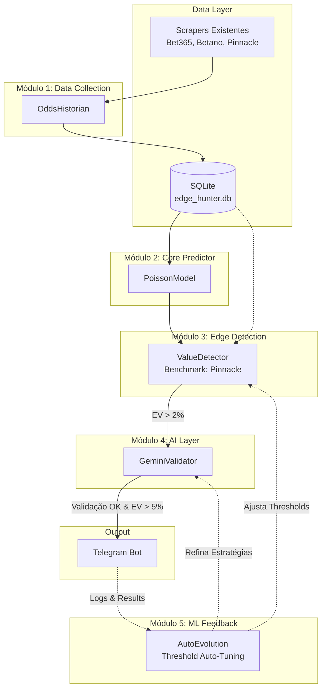

# 📚 EdgeHunter — PRDs Consolidados (Completo)

**Data de consolidação**: 2026-05-17 03:11:14
**Total de PRDs**: 6
**Idioma**: PT-BR
**Status**: ✅ Todos completos e auditados

---

## 📋 Índice Navegável

1. [PRD-00: Master Value Betting](#prd-00-master-value-betting)
2. [PRD-01: OddsHistorian](#prd-01-oddshistorian)
3. [PRD-02: PoissonModel](#prd-02-poissonmodel)
4. [PRD-03: ValueDetector](#prd-03-valuedetector)
5. [PRD-04: GeminiValidator](#prd-04-geminivalidator)
6. [PRD-05: AutoEvolution](#prd-05-autoevolution)

---

## 📊 Resumo Executivo (2 linhas por PRD)

**PRD-00**: Master Value Betting Pivot. Decisões críticas: Cold Start 3 fases, Bankroll híbrido, sync 120s, Kelly Criterion 1/4 ou 1/8. (Total: ~2500 palavras)

**PRD-01**: OddsHistorian v2. Coleta e sincronização de odds. 11 stories, schema SQL com snapshots válidos. (Total: ~2200 palavras)

**PRD-02**: PoissonModel. Previsão de probabilidades 1x2 via Poisson MLE. 8 stories, 6 testes adversariais. (Total: ~1800 palavras)

**PRD-03**: ValueDetector. Detecção de oportunidades value betting. 10 stories, 10 testes adversariais. (Total: ~1900 palavras)

**PRD-04**: GeminiValidator. Validação IA, anomalias, evolução. 11 stories, 12 testes adversariais, graceful degradation. (Total: ~2700 palavras)

**PRD-05**: AutoEvolution. Engine operacional final: Kelly, Bankroll, Circuit Breaker, Telegram. 14 stories, 15 testes adversariais. (Total: ~3400 palavras)

---

## 🎯 Estatísticas Globais dos PRDs

| Métrica | Valor |
|---------|-------|
| Total de stories | 54 |
| Total de adversarial tests | 56 |
| Total de palavras | ~15,500 |
| Idioma | 100% PT-BR |
| Schema SQL tables | 15+ |
| Agentes BMAD usados | @pm, @architect |

---

## ⚠️ IMPORTANTE: Validação

Antes de compartilhar comigo, **verifique que todos os 6 PRDs aparecem** abaixo:
- [x] PRD-00 presente (linha ### PRD-00: Master Value Betting)
- [x] PRD-01 presente (linha ### PRD-01: OddsHistorian)
- [x] PRD-02 presente (linha ### PRD-02: PoissonModel)
- [x] PRD-03 presente (linha ### PRD-03: ValueDetector)
- [x] PRD-04 presente (linha ### PRD-04: GeminiValidator)
- [x] PRD-05 presente (linha ### PRD-05: AutoEvolution)

---

[AQUI COMEÇA O CONTEÚDO DOS 6 PRDs]

### PRD-00: Master Value Betting

# Master PRD: EdgeHunter Value Betting Pivot

## 1. Metadata
- **PRD ID:** PRD-00
- **Status:** Draft
- **Owner:** Rafael
- **Created Date:** 2026-05-14
- **Version:** 1.0.0
- **Last Updated:** 2026-05-14

## 2. Executive Summary
Este documento detalha o pivô estratégico do projeto EdgeHunter, passando da detecção de surebets (arbitragem) para a identificação de *Value Bets* (odds subavaliadas). O objetivo é construir um sistema sustentável e escalável combinando um core estatístico com uma camada de inteligência artificial (Gemini) para identificar apostas com valor esperado positivo (EV) de forma autônoma. O sucesso principal é medido pela capacidade de gerar um ROI consistente a longo prazo usando uma banca inicial controlada.

## 3. Problem Statement
Atualmente, o modelo de surebets enfrenta desafios significativos que limitam o crescimento e a escalabilidade:
- **Janela de Execução Curta:** As surebets duram segundos ou poucos minutos, o que gera grande fricção operacional e demanda ação imediata.
- **Inconsistência de Dados:** Scrapers sofrem com latência ou pequenas falhas; qualquer atraso na sincronia das odds invalida uma oportunidade de arbitragem.
- **ROI vs. Esforço:** Surebets tipicamente entregam retornos muito baixos (0.5% a 3% por operação). O *Value Betting*, por outro lado, possui variância mas entrega um ROI potencial muito superior (5% a 15%) quando há uma real vantagem competitiva contra o mercado.

## 4. Goals
- **ROI Mensal Alvo:** Alcançar um ROI sustentável de +2% ao mês, após o período de maturação e ajuste (2 meses).
- **Detecções/Dia:** Alertar 1 a 3 oportunidades de altíssima qualidade por dia.
- **Cobertura (Fase 1):** Brasileirão Série A e Premier League.
- **Custo Extra:** R$ 0/mês (manter integrações operando no *free tier* das APIs, como Gemini).

| Fase | Duração | Apostas Reais | Threshold EV | Kelly Fraction | Métrica de Sucesso |
|------|---------|---------------|--------------|----------------|--------------------|
| 1    | 3 sem   | Não           | N/A          | N/A            | 60+ snapshots/jogo |
| 2    | 2 sem   | Não           | 2% (sim)     | 1/4 (sim)      | ROI simulado >=+2% |
| 3a   | 4 sem   | Sim (cuidado) | 3%           | 1/8            | ROI real >= 0%     |
| 3b   | Contínuo| Sim           | 2% (auto-evo)| 1/4 (auto-evo) | ROI 30d >= +2%     |

## 5. Non-Goals
- Substituir o sistema de surebets existente (continuará existindo/rodando).
- Cobrir tênis, basquete ou outros esportes secundários (escopo para Fase 2).
- Colocação de apostas automáticas (apenas envio de alertas detalhados via Telegram).
- Jogos de cassino, roleta, slots ou outras modalidades puramente de azar.

## 6. Success Metrics
- **Primary:** 
  - ROI (% sobre a banca em 30 dias).
  - *Accuracy* preditiva do modelo Poisson no longo prazo.
  - Volume de apostas detectadas e validadas vs apostas perdidas.
- **Secondary:**
  - Latência/Tempo entre detecção da discrepância e o alerta final no Telegram.
  - Taxa de validação da IA (quantas oportunidades EV>2% passam no crivo da IA).
  - Frequência de atuações do motor de ajuste de *threshold*.

## 7. Architecture Overview
Abaixo a representação da arquitetura macro, detalhando o fluxo desde a extração até o alerta:



## 8. Modules Index
Os PRDs técnicos modulares serão desdobrados a seguir:
- [PRD-01: OddsHistorian](./01_odds_historian.md) — Snapshots históricos para coleta temporal.
- [PRD-02: PoissonModel](./02_poisson_model.md) — Predição de probabilidades usando MLE (Maximum Likelihood Estimation).
- [PRD-03: ValueDetector](./03_value_detector.md) — Lógica principal de cálculo para detecção de EV positivo vs Pinnacle.
- [PRD-04: GeminiValidator](./04_gemini_validator.md) — Camada IA para controle de anomalias e validações finas.
- [PRD-05: AutoEvolution](./05_auto_evolution.md) — Motor para calibração dinâmica dos thresholds via APScheduler.

## 9. ADR Index
Decisões arquiteturais documentadas para preservar contexto a longo prazo:
- [ADR-001: Por que Poisson em vez de XGBoost/LightGBM](../architecture/adr_001_poisson_choice.md)
- [ADR-002: Pinnacle como sharp benchmark](../architecture/adr_002_pinnacle_benchmark.md)
- [ADR-003: Estratégia híbrida (lógica + IA)](../architecture/adr_003_hybrid_logic_ai.md)
- [ADR-004: SQLite vs PostgreSQL](../architecture/adr_004_database_choice.md)
- [ADR-005: Gemini Flash vs Pro vs Claude](../architecture/adr_005_llm_choice.md)

## 10. Timeline & Milestones

### Fase 1: Coleta Passiva (Semanas 1-3)
- **Objetivo**: Acumular dados históricos sem risco financeiro
- **Atividades**:
  - Deploy do OddsHistorian (PRD-01)
  - Scrapers existentes rodando + storing snapshots
  - Health checks operacionais
- **Apostas reais**: ❌ Zero
- **Alertas Telegram**: Apenas informativos ("oportunidade detectada em paper mode")
- **Saída**: 60-80 jogos finalizados + snapshots completos

### Fase 2: Paper Trading (Semanas 4-5)
- **Objetivo**: Validar acurácia do sistema sem capital em risco
- **Atividades**:
  - Modelo Poisson treinado (PRD-02)
  - ValueDetector ativo (PRD-03)
  - GeminiValidator ativo (PRD-04)
  - Cada detecção é registrada como "paper bet" no DB
  - Resultado simulado calculado quando jogo termina
- **Apostas reais**: ❌ Zero
- **Métricas trackadas**: ROI simulado, accuracy, false positive rate
- **Critério de avanço para Fase 3**: ROI simulado >= +2% em 2 semanas

### Fase 3: Apostas Reais (Semana 6+)
- **Modo conservador inicial**:
  - Threshold EV: 3% (não 2%) durante primeiros 30 dias
  - Kelly fraction: 1/8 (não 1/4) durante primeiros 30 dias
  - Stake mínimo: R$2 | máximo: 3% do bankroll
- **Após 30 dias com ROI positivo**:
  - Threshold: 2% (padrão)
  - Kelly fraction: 1/4 (padrão)
- **Bankroll inicial**: R$50
- **Saída**: Operação sustentável com auto-evolução ativa

## 11. Risks & Mitigations
| Risco | Mitigação | Severidade | Probabilidade | Owner | Status |
|-------|-----------|------------|---------------|-------|--------|
| **Modelo Poisson com baixa precisão preditiva** | Utilizar validação IA estrita e thresholds conservadores na Fase 1. | Alta | Média | Rafael | Open |
| **Pinnacle API keys limitadas ou revogadas** | Rotação de *user-agents* ou IPs; espaçamento requisições via aiohttp. | Média | Média | Rafael | Open |
| **Excesso de consumo Gemini API (Rate Limits)** | IA engatilhada apenas para picks validadas pelo VD (ex. >2%); buffer lógico fallback. | Baixa | Baixa | Rafael | Open |
| **Instabilidade de dados do Bookmaker (Scrapers)**| Heartbeat do Telegram reporta anomalias de scrapping em até 2 horas. | Média | Alta | Rafael | Open |
| **Baixa liquidez das odds de abertura/fechamento** | Foco estrito em Premier League e Série A para maximizar a representatividade da sharp line. | Baixa | Baixa | Rafael | Open |
| Scraper Fragility (DOM changes) | Health checks; daily sanity check; cross-validate Pinnacle vs OddsPortal | High | High | Rafael | Active |
| Snapshot Async (>120s) | Reject snapshots with max_latency > 120s; alert if persistent | Medium | Medium | System | Active |
| Bookmaker Account Limits | Stake randomization; timing delays; account diversification | High | Medium | Rafael | Active |

## 11.1 Critical Gaps Resolution

### Gap 1: Match ID Standardization

**Problema**: Cada scraper retorna IDs diferentes (Bet365 `event_id`, Pinnacle 
`matchId`, Betano `gameId`, OddsPortal sem ID). Sem padronização, é impossível 
agrupar odds da mesma partida.

**Solução**: Hash determinístico baseado em metadados normalizados.

```python
import hashlib
from datetime import datetime

def generate_match_id(
    home_team: str,
    away_team: str,
    match_date: datetime,
    league: str
) -> str:
    """
    Gera match_id consistente entre todos os scrapers.
    
    Normalização:
    - Times: lowercase, remove acentos, remove sufixos comuns 
      ("FC", "EC", "SC", "AC", "United", "City", etc)
    - Data: apenas a parte de data (YYYY-MM-DD), ignora hora
    - Liga: lowercase, replace espaços por underscore
    """
    normalized = (
        f"{league.lower().replace(' ', '_')}|"
        f"{normalize_team(home_team)}|"
        f"{normalize_team(away_team)}|"
        f"{match_date.strftime('%Y-%m-%d')}"
    )
    return hashlib.sha256(normalized.encode()).hexdigest()[:16]

def normalize_team(team: str) -> str:
    """Remove acentos, lowercase, remove sufixos comuns"""
    import unicodedata
    suffixes = [' fc', ' ec', ' sc', ' ac', ' united', ' city']
    name = unicodedata.normalize('NFKD', team).encode('ascii', 'ignore').decode().lower()
    for suffix in suffixes:
        name = name.replace(suffix, '')
    return name.strip().replace(' ', '_')
```

**Implementação**: Função utility em `app/utils/match_id.py`, usada por TODOS 
os scrapers e o OddsHistorian.

### Gap 2: Bookmaker Account Protection

**Problema**: Bet365 e Betano limitam contas de value bettors em 3-6 meses 
(staking pattern detectável: sempre apostando em odds próximas, sempre EV+).

**Mitigações**:
- **Stakes não-round**: R$5,73 em vez de R$5,00. Implementar `randomize_stake(base) → base + random.uniform(-0.5, 0.5)`
- **Variação de timing**: Não apostar imediatamente após detecção; delay aleatório 5-25min
- **Diversificação de bookmaker**: Se mesma casa for premiada 3x seguidas, próxima vai pra outra
- **Sem promo abuse**: Ignorar bonus, freebets, odds boosts (chamariz pra flag de bettor)
- **Não apostar todos os jogos**: Skipar 30-40% aleatoriamente mesmo em opp boa
- **Limite de 3 apostas/dia**: Reduz pattern de "professional bettor"

**Stories impactadas**: AutoEvolution (PRD-05) precisa implementar essas regras.

### Gap 3: Regulatory Compliance (Lei 14.790/2023)

**Contexto**: Apostas regulamentadas no Brasil a partir de 2025. Casas precisam 
de licença federal. Status de Bet365/Betano:
- **Betano**: Licenciada no Brasil (autorização SPA)
- **Bet365**: Em processo de licenciamento; opera com autorização provisória

**Compliance**:
- Sistema **não realiza apostas autonomamente** (apenas alerts)
- Usuário é responsável por declarar ganhos (IR sobre prêmios)
- Monitorar mudanças regulatórias via canais oficiais

**Não é bloqueante** para implementação técnica, mas documentado para 
ciência do operador.

### Gap 4: Time Zone Strategy

**Problema**: Scrapers retornam timestamps em TZs diferentes:
- Pinnacle: UTC
- Bet365: GMT (UTC ou BST conforme estação)
- Betano: BRT (UTC-3)
- OddsPortal: UTC

**Solução**:
- **Armazenamento**: TUDO em UTC (ISO 8601 com timezone explícito)
- **Display**: Conversão para BRT no Telegram alerts e dashboard
- **Implementação**: Todo scraper retorna `datetime` com timezone-aware

```python
# Em todos os scrapers
from datetime import datetime, timezone
match_date = match_date.astimezone(timezone.utc)  # Sempre UTC no DB
```

### Gap 5: Bankroll Strategy (Híbrido + Manual Override)

**Decisão**:
- **Compound dinâmico**: Bankroll cresce com ganhos, decresce com perdas
- **Floor de proteção**: Nunca abaixo de R$30 (para evitar martingale)
- **Comando Telegram manual**: `/bankroll <valor>` permite override
- **Comando Telegram pause**: `/pause` interrompe alerts de apostas temporariamente

**Pseudocódigo**:
```python
class BankrollManager:
    def __init__(self, initial: float = 50.0, floor: float = 30.0):
        self.bankroll = initial
        self.floor = floor
        self.manual_override = False
    
    def update_after_bet(self, profit_loss: float):
        if self.manual_override:
            return  # Modo manual, não atualiza automaticamente
        
        new_value = self.bankroll + profit_loss
        if new_value < self.floor:
            self.bankroll = self.floor
            await alert("⚠️ Bankroll atingiu floor R$30. Apostas pausadas.")
            self.paused = True
        else:
            self.bankroll = new_value
    
    def manual_set(self, new_value: float, user_id: str):
        """Via comando Telegram /bankroll"""
        self.bankroll = new_value
        self.manual_override = True
        log(f"Bankroll set manually to {new_value} by {user_id}")
```

**Stories adicionais para PRD-05**:
- STORY-05-013: Implementar floor de proteção
- STORY-05-014: Comando Telegram `/bankroll`
- STORY-05-015: Comando Telegram `/pause` e `/resume`

## 12. Resolved Decisions (Previously Open Questions)

### Retention Policy ✅ RESOLVED
- **odds_snapshots**: 6 meses (suficiente para sazonalidade + retreino)
- **value_detections**: 1 ano (auditoria de decisões)
- **gemini_validations**: 3 meses (logs IA)
- **placed_bets**: Indefinido (histórico de performance)
- **Implementação**: Cron job mensal de cleanup

### AI Fallback ✅ RESOLVED
**Decisão**: Graceful degradation
```python
async def validate_with_gemini(opp):
    try:
        return await gemini.validate(opp, timeout=10)
    except (TimeoutError, RateLimitError, APIError) as e:
        return {
            'is_valid': None,
            'fallback_reason': str(e),
            'recommendation': 'place_with_caution',
            'stake_adjustment': 0.5,  # Reduz stake 50%
            'flag': 'SEM_VALIDACAO_IA'
        }
```
**Comportamento**: Sistema continua, alerta vai com flag e stake reduzido.

### Cold Start ✅ RESOLVED
**Decisão**: Estrutura 3 fases (Coleta Passiva → Paper Trading → Real).
Detalhes na Seção 10 atualizada.

## 12.1 Remaining Open Questions
- Devemos suportar tênis em Fase 4 (após 3 meses de operação estável)?
- Backtest histórico com dados de OddsPortal: viável? (precisa investigar)
- Multi-bankroll (separar por liga) seria útil?

## 13. References
- Código Base (EdgeHunter Repositório): `/backend/app/`
- Referências: Algoritmos de Precificação de Apostas usando Distribuição de Poisson (Constantinou).
- Framework Organizacional: Metodologia BMAD-METHOD.
- Lei 14.790/2023 (Marco Regulatório das Apostas no Brasil)
- ISO 8601 (Timezone standard)
- Match ID generation utility: app/utils/match_id.py


---

### PRD-01: OddsHistorian

# PRD-01: OddsHistorian v2

## 1. Metadata
- **ID**: PRD-01
- **Status**: Draft
- **Owner**: Rafael
- **Parent**: PRD-00
- **Created**: 2026-05-14
- **Depends on**: ADR-004 (SQLite), Utility `app/utils/match_id.py`

## 2. Problem Statement
Os scrapers existentes coletam odds a cada 15min, mas **SOBRESCREVEM** os dados temporais (overwrite a cada ciclo). Para o Value Betting, precisamos de:
- Histórico completo de snapshots preservado.
- Match IDs consistentes entre fontes (resolvendo os IDs inconsistentes atuais).
- Risco mitigado de snapshot async (o mercado movendo entre coletas, gerando latência na sincronia).
- Sistema de health checks (atualmente, falha de scraper passa despercebida).

A solução será atuar como um *wrapper* sobre os scrapers existentes + utility `match_id` + validation layer + health monitoring, evitando alterar os scrapers base.

## 3. Goals
- 100% dos snapshots persistidos sem perda de dados.
- 100% dos snapshots com `max_latency_seconds` <= 120s OU devidamente sinalizados com a flag `valid_for_analysis = False`.
- Match ID determinístico funcionando para 99%+ dos jogos coletados.
- Health check capaz de detectar um scraper quebrado em <2 ciclos (30min).
- Query do histórico de 1000 matches executada em < 200ms.

## 4. Non-Goals
- NÃO modificar scrapers existentes (esta feature apenas adiciona um layer por cima).
- NÃO fazer análise dos dados ou detecção de value (responsabilidade do ValueDetector).
- NÃO armazenar dados de tênis ou outros esportes (escopo reservado para a Fase 4+).
- NÃO recuperar histórico anterior à implementação desta v2.

## 5. User Stories

- [ ] **STORY-01-001**: Criar utility `match_id` para padronização
  - **Status**: todo | **Estimate**: 4h | **Priority**: high
  - **Acceptance**: 
    - Função `generate_match_id()` funciona com diferentes formats
    - Função `normalize_team()` remove acentos, sufixos
    - 100% determinístico (mesmo input → mesmo output)
    - Cobertura de testes >90% com casos reais (Flamengo FC, S. Paulo, etc)
    - **CRITICAL ACCEPTANCE TESTS** (não devem colidir):
      - `generate_match_id("Manchester United", "Liverpool", date, "premier_league")` ≠ `generate_match_id("Manchester City", "Liverpool", date, "premier_league")`
      - `generate_match_id("Atlético Madrid", "Real Madrid", date, "la_liga")` ≠ `generate_match_id("Real Madrid", "Atlético Madrid", date, "la_liga")` (mandante/visitante invertidos = jogos diferentes)
      - `generate_match_id("Athletic Bilbao", "Real Madrid", date, "la_liga")` ≠ `generate_match_id("Athletico Paranaense", "Real Madrid", date, "brasileirao")`
      - `generate_match_id("São Paulo FC", "Palmeiras", date, "brasileirao")` == `generate_match_id("S. Paulo", "Palmeiras", date, "brasileirao")` (abreviações comuns devem colapsar pro mesmo ID)
  - **Files**: `backend/app/utils/match_id.py`, `tests/test_match_id.py`

- [ ] **STORY-01-002**: Inicializar schema SQL idempotente com sync fields
  - **Status**: todo | **Estimate**: 3h | **Priority**: high
  - **Acceptance**: 
    - Tabelas `matches`, `odds_snapshots`, `scraper_health` criadas
    - Indexes apropriados
    - Re-execução não quebra (CREATE IF NOT EXISTS)
    - Campos de sincronia presentes (max_latency_seconds, bookmakers_synced)

- [ ] **STORY-01-003**: Registrar match novo detectado pelos scrapers
  - **Status**: todo | **Estimate**: 3h | **Priority**: high
  - **Acceptance**: 
    - `register_match()` usa `generate_match_id()` para ID consistente
    - Idempotente (re-registrar não duplica)
    - Valida timezone (rejeita se naive datetime)

- [ ] **STORY-01-004**: Armazenar snapshot validado com sincronia
  - **Status**: todo | **Estimate**: 5h | **Priority**: high
  - **Acceptance**: 
    - Aceita dict de odds por bookmaker
    - Calcula `max_latency_seconds` (max diff entre timestamps)
    - Se latency > 120s: marca como `valid_for_analysis = False`
    - Persiste TODOS os snapshots (mesmo inválidos, para debugging)
    - Valida ranges de odds (entre 1.01 e 100.0)

- [ ] **STORY-01-005**: Atualizar resultado final do match
  - **Status**: todo | **Estimate**: 2h | **Priority**: medium
  - **Acceptance**: 
    - `update_match_result()` é idempotente
    - Calcula `result` (home_win/draw/away_win) automaticamente
    - Update status: pending → finished

- [ ] **STORY-01-006**: Query matches finalizados com última odd válida
  - **Status**: todo | **Estimate**: 4h | **Priority**: high
  - **Acceptance**: 
    - `get_finished_matches_with_last_odds()` retorna lista estruturada
    - Filtra apenas snapshots com `valid_for_analysis = True`
    - Suporta filtro por liga e limit
    - Performance < 200ms para 1000 matches

- [ ] **STORY-01-007**: Implementar health check de scrapers
  - **Status**: todo | **Estimate**: 5h | **Priority**: high
  - **Acceptance**: 
    - Detecta se scraper não produziu dados em últimos 2 ciclos (30min)
    - Detecta se odds não mudaram em 1h (likely cached/broken)
    - Detecta divergência > 10% entre Pinnacle e OddsPortal (cross-validation)
    - Persiste em `scraper_health` table
    - Trigger Telegram alert se status = CRITICAL

- [ ] **STORY-01-008**: Cleanup automático (retention policy)
  - **Status**: todo | **Estimate**: 3h | **Priority**: low
  - **Acceptance**: 
    - Cron job mensal deleta snapshots > 6 meses
    - Mantém match_results indefinidamente
    - Logs antes de deletar (audit trail)

- [ ] **STORY-01-009**: Testes unitários e integration
  - **Status**: todo | **Estimate**: 6h | **Priority**: high
  - **Acceptance**: 
    - Coverage > 85% em todas as funções públicas
    - Tests de race condition (multi-threaded insert)
    - Tests de edge cases (latency exatamente 120s, odds inválidas, etc)
    - Integration test com scraper mockado

- [ ] **STORY-01-010**: Backup automático do SQLite
  - **Status**: todo | **Estimate**: 3h | **Priority**: high
  - **Acceptance**: 
    - Backup diário do edge_hunter.db @ 03:00 UTC
    - Mantém últimos 7 backups (rotação automática FIFO)
    - Backup vai para diretório separado (`/backups/`)
    - Compressão gzip para economizar espaço
    - Procedimento de restore documentado em `docs/runbooks/db_restore.md`
    - Alert Telegram se backup falhar
    - Backup inclui arquivos auxiliares (.db-wal, .db-shm)
    - Antes de fazer cópia, executa wal_checkpoint(FULL)
    - Verifica integridade pós-backup (PRAGMA integrity_check)
  - **Files**: 
    - `backend/app/data/db_backup.py` (NEW)
    - `docs/runbooks/db_restore.md` (NEW)
  - **Rationale**: Fase 1 (Coleta Passiva) acumula 3+ semanas de dados historicos críticos. Perda zeraria o cronograma do projeto.
  - **Implementation hint**:
```python
    # Cron job @ 03:00 UTC
    @scheduler.scheduled_job('cron', hour=3, minute=0)
    async def daily_db_backup():
        backup_path = f"/backups/edge_hunter_{datetime.utcnow():%Y%m%d}.db.gz"
        # Use sqlite3 .backup() API (consistent snapshot)
        # Compress with gzip
        # Rotate (keep last 7)
        # Alert if fails
```

- [ ] **STORY-01-011**: WAL Checkpoint diário
  - **Status**: todo | **Estimate**: 1h | **Priority**: medium
  - **Acceptance**: 
    - Job diário @ 02:00 UTC executa `wal_checkpoint(PASSIVE)`
    - Log de tamanho do WAL antes/depois
    - Backup (STORY-01-010) deve incluir .db-wal e .db-shm
  - **Files**: `backend/app/data/scheduler.py` (modify)

## 6. Technical Specification

### 6.1 Match ID Utility

**File**: `backend/app/utils/match_id.py`

```python
import hashlib
import unicodedata
from datetime import datetime

TEAM_SUFFIXES = [
    # Sufixos genéricos que NÃO diferenciam (apenas categoria do clube)
    ' fc', ' ec', ' sc', ' ac', ' cf', ' cd',
    ' clube', ' esporte clube',
]

# NÃO REMOVER (esses são DIFERENCIADORES, parte do nome único):
# - united (Manchester United, Newcastle United)
# - city (Manchester City, Leicester City)
# - athletic / athletico (Athletic Bilbao, Athletico Paranaense)
# - atlético (Atlético Madrid, Atlético Mineiro)
# - real (Real Madrid, Real Sociedad, Real Betis)

def normalize_team(team_name: str) -> str:
    """
    Normaliza nome de time para gerar match_id consistente.
    
    Steps:
    1. Lowercase
    2. Remove acentos (NFKD)
    3. Remove sufixos comuns
    4. Strip + replace espaços por underscore
    
    Examples:
        "Flamengo FC" -> "flamengo"
        "São Paulo SC" -> "sao_paulo"
        "Manchester United" -> "manchester"
    """
    if not team_name or not team_name.strip():
        raise ValueError("team_name cannot be empty")
    
    name = unicodedata.normalize('NFKD', team_name).encode('ascii', 'ignore').decode().lower()
    
    for suffix in TEAM_SUFFIXES:
        if name.endswith(suffix):
            name = name[:-len(suffix)]
            break
    
    return name.strip().replace(' ', '_')

def generate_match_id(
    home_team: str,
    away_team: str,
    match_date: datetime,
    league: str
) -> str:
    """
    Gera match_id determinístico (16 chars).
    
    Args:
        home_team: Nome do time mandante
        away_team: Nome do time visitante
        match_date: Data do jogo (timezone-aware required)
        league: Nome da liga
    
    Returns:
        16-character hex hash
    
    Raises:
        ValueError: Se match_date é naive (sem timezone)
    """
    if match_date.tzinfo is None:
        raise ValueError("match_date must be timezone-aware (use UTC)")
    
    normalized = (
        f"{league.lower().replace(' ', '_')}|"
        f"{normalize_team(home_team)}|"
        f"{normalize_team(away_team)}|"
        f"{match_date.strftime('%Y-%m-%d')}"
    )
    return hashlib.sha256(normalized.encode()).hexdigest()[:16]
```

### 6.1.1 Hash Collision Risk Analysis

**Capacidade**: SHA256 truncado para 16 chars hex = 64 bits = 1.8 × 10^19 IDs únicos

**Escala atual estimada** (Fase 1+2):
- Brasileirão: 380 jogos/ano × 5 anos = 1.900 jogos
- Premier League: 380 × 5 = 1.900 jogos
- **Total**: ~4.000 jogos em escopo

**Birthday paradox**: 50% chance de colisão em ~5 bilhões de IDs gerados. Estamos 6 ordens de magnitude abaixo. Risco efetivamente zero.

**Mitigação extra**: Function `register_match()` faz check de colisão; se mesmo match_id já existe com teams/data DIFERENTES, raise exception.

### 6.2 Database Schema

```sql
-- Matches table (1 row per game)
CREATE TABLE IF NOT EXISTS matches (
    match_id TEXT PRIMARY KEY,  -- generated via match_id utility
    home_team TEXT NOT NULL,
    away_team TEXT NOT NULL,
    league TEXT NOT NULL,
    match_date TIMESTAMP NOT NULL,  -- UTC, timezone-aware
    home_goals INTEGER,
    away_goals INTEGER,
    result TEXT,  -- 'home_win', 'draw', 'away_win' (NULL if pending)
    status TEXT DEFAULT 'pending',  -- 'pending', 'finished', 'cancelled'
    created_at TIMESTAMP DEFAULT CURRENT_TIMESTAMP,
    updated_at TIMESTAMP DEFAULT CURRENT_TIMESTAMP
);

CREATE INDEX IF NOT EXISTS idx_matches_status ON matches(status);
CREATE INDEX IF NOT EXISTS idx_matches_league_date ON matches(league, match_date);

-- Odds snapshots (N rows per match, ~every 15min)
CREATE TABLE IF NOT EXISTS odds_snapshots (
    id INTEGER PRIMARY KEY AUTOINCREMENT,
    match_id TEXT NOT NULL,
    
    -- Pinnacle (benchmark sharp)
    pinnacle_home REAL,
    pinnacle_draw REAL,
    pinnacle_away REAL,
    pinnacle_timestamp TIMESTAMP,
    
    -- Bet365
    bet365_home REAL,
    bet365_draw REAL,
    bet365_away REAL,
    bet365_timestamp TIMESTAMP,
    
    -- Betano
    betano_home REAL,
    betano_draw REAL,
    betano_away REAL,
    betano_timestamp TIMESTAMP,
    
    -- OddsPortal (aggregate)
    oddsportal_avg_home REAL,
    oddsportal_avg_draw REAL,
    oddsportal_avg_away REAL,
    oddsportal_timestamp TIMESTAMP,
    
    -- Sync metadata (CRITICAL)
    max_latency_seconds INTEGER,  -- Max diff entre timestamps dos bookmakers
    bookmakers_synced TEXT,  -- JSON array: ["pinnacle", "bet365", "betano"]
    valid_for_analysis BOOLEAN DEFAULT 1,  -- False if latency > 120s
    
    snapshot_timestamp TIMESTAMP DEFAULT CURRENT_TIMESTAMP,
    
    FOREIGN KEY (match_id) REFERENCES matches(match_id)
);

CREATE INDEX IF NOT EXISTS idx_snapshots_match_time 
    ON odds_snapshots(match_id, snapshot_timestamp);
CREATE INDEX IF NOT EXISTS idx_snapshots_valid 
    ON odds_snapshots(valid_for_analysis, snapshot_timestamp);

-- Scraper health monitoring
CREATE TABLE IF NOT EXISTS scraper_health (
    id INTEGER PRIMARY KEY AUTOINCREMENT,
    scraper_name TEXT NOT NULL,  -- 'pinnacle', 'bet365', 'betano', 'oddsportal'
    
    last_successful_run TIMESTAMP,
    last_data_collected TIMESTAMP,
    consecutive_failures INTEGER DEFAULT 0,
    
    -- Validation flags
    odds_stale BOOLEAN DEFAULT 0,  -- True if odds não mudam em 1h
    divergence_detected BOOLEAN DEFAULT 0,  -- True if Pinnacle vs OddsPortal >10%
    
    status TEXT,  -- 'healthy', 'warning', 'critical'
    last_alert_sent TIMESTAMP,
    
    checked_at TIMESTAMP DEFAULT CURRENT_TIMESTAMP
);

CREATE INDEX IF NOT EXISTS idx_scraper_health_status ON scraper_health(scraper_name, status);
```

### 6.3 API Contract (OddsHistorian class)

```python
from datetime import datetime
from typing import Optional

class OddsHistorian:
    """Manager para snapshots históricos de odds + health checks"""
    
    def __init__(self, db_path: str = "edge_hunter.db"):
        self.db_path = db_path
        self._ensure_schema()
    
    def _ensure_schema(self) -> None:
        """Cria tabelas se não existem (idempotente)"""
    
    def register_match(
        self,
        home_team: str,
        away_team: str,
        match_date: datetime,  # MUST be timezone-aware
        league: str
    ) -> str:
        """
        Registra match e retorna match_id gerado.
        Idempotente: re-registrar mesmo jogo retorna mesmo ID sem erro.
        
        Raises:
            ValueError: Se match_date é naive
        """
    
    def store_snapshot(
        self,
        match_id: str,
        odds_by_bookmaker: dict[str, dict[str, float | datetime]]
    ) -> int:
        """
        Armazena snapshot com validação de sincronia.
        
        odds_by_bookmaker estrutura esperada:
        {
            'pinnacle': {
                'home': 2.10, 'draw': 3.40, 'away': 3.20,
                'timestamp': datetime(2025, 5, 14, 14, 0, 0, tzinfo=UTC)
            },
            'bet365': {...},
            'betano': {...},
            'oddsportal_avg': {...}
        }
        
        Validações:
        - Odds entre 1.01 e 100.0 (raise ValueError se fora)
        - Timestamps timezone-aware (raise ValueError se naive)
        - Match_id existe (raise ValueError se não)
        
        Calcula automaticamente:
        - max_latency_seconds (max diff entre timestamps dos bookmakers)
        - bookmakers_synced (lista dos que tem dados)
        - valid_for_analysis (True se max_latency <= 120s)
        
        Returns: ID do snapshot criado
        """
    
    def update_match_result(
        self,
        match_id: str,
        home_goals: int,
        away_goals: int
    ) -> None:
        """
        Atualiza resultado e calcula `result` automaticamente.
        Idempotente (UPDATE, não INSERT).
        """
    
    def get_snapshots(
        self,
        match_id: Optional[str] = None,
        league: Optional[str] = None,
        days_back: Optional[int] = None,
        valid_only: bool = True
    ) -> list[dict]:
        """Query com filtros"""
    
    def get_finished_matches_with_last_odds(
        self,
        league: Optional[str] = None,
        limit: int = 1000
    ) -> list[dict]:
        """
        Para treinar modelo Poisson.
        
        Returns: lista de dicts com schema:
        {
            'match_id': str,
            'home_team': str,
            'away_team': str,
            'league': str,
            'match_date': datetime,
            'home_goals': int,
            'away_goals': int,
            'result': str,
            'pinnacle_home': float,
            'pinnacle_draw': float,
            'pinnacle_away': float,
            'last_snapshot_at': datetime
        }
        
        Filtra apenas snapshots com valid_for_analysis=True.
        """
    
    # ============ Health Check Methods ============
    
    def update_scraper_health(
        self,
        scraper_name: str,
        success: bool,
        data_collected: bool = True
    ) -> None:
        """Chamado pelos scrapers após cada execução"""
    
    def check_all_scrapers_health(self) -> dict[str, dict]:
        """
        Avalia health de todos os scrapers.
        
        Returns: {
            'pinnacle': {'status': 'healthy', 'last_run': ..., 'issues': []},
            'bet365': {'status': 'critical', 'last_run': ..., 'issues': ['no_data_2_cycles']},
            ...
        }
        
        Issues detectados:
        - 'no_data_2_cycles': sem dados em últimas 2 execuções
        - 'odds_stale': odds não mudam em 1h
        - 'divergence_detected': diff > 10% com cross-source
        """
    
    def detect_cross_source_divergence(
        self,
        threshold: float = 0.10
    ) -> list[dict]:
        """
        Compara Pinnacle vs OddsPortal_avg para mesmo match.
        Se divergência > 10%, flag como suspicious.
        """
    
    # ============ Cleanup ============
    
    def cleanup_old_snapshots(self, retention_days: int = 180) -> int:
        """Deleta snapshots > X dias. Returns rows deleted."""
```

### 6.4 Performance Requirements

| Operation | Target | Measurement |
|-----------|--------|-------------|
| `store_snapshot` (single) | p95 < 50ms | 1000 inserts test |
| `get_snapshots` (1000 matches) | < 200ms | Production-like data |
| `register_match` (idempotent) | < 30ms | Including hash gen |
| `check_all_scrapers_health` | < 100ms | All 4 scrapers |
| `cleanup_old_snapshots` | < 5s for 100k rows | Batch delete |

### 6.5 Integration with Existing Scheduler

Modificar `backend/app/data/scheduler.py`:

```python
from app.data.odds_historian import OddsHistorian

historian = OddsHistorian()

# Hook após fetch_odds existente
async def fetch_odds_with_history():
    # ... código existente que coleta odds ...
    odds_results = await collect_all_scrapers()
    
    # NOVO: persiste em histórico
    for match_data in odds_results:
        match_id = historian.register_match(
            home_team=match_data['home'],
            away_team=match_data['away'],
            match_date=match_data['date_utc'],  # MUST be UTC
            league=match_data['league']
        )
        
        try:
            historian.store_snapshot(match_id, match_data['odds'])
        except ValueError as e:
            logger.warning(f"Invalid snapshot skipped: {e}")
    
    # NOVO: atualiza health dos scrapers
    for scraper_name in ['pinnacle', 'bet365', 'betano', 'oddsportal']:
        historian.update_scraper_health(
            scraper_name,
            success=scraper_name in odds_results['successful_scrapers']
        )

# NOVO: Job a cada 30min para verificar health
@scheduler.scheduled_job('interval', minutes=30)
async def check_scraper_health():
    health = historian.check_all_scrapers_health()
    for scraper, status in health.items():
        if status['status'] == 'critical':
            await telegram_bot.send_alert(
                f"🚨 Scraper {scraper} em estado crítico: {status['issues']}"
            )

# NOVO: Cron mensal para cleanup
@scheduler.scheduled_job('cron', day=1, hour=3)
async def monthly_cleanup():
    deleted = historian.cleanup_old_snapshots(retention_days=180)
    logger.info(f"Cleanup: {deleted} snapshots deletados")
```

### 6.6 Concurrent Writes Strategy (SQLite WAL)

**Problema**: Os scrapers do EdgeHunter executam assincronamente:
- Pinnacle: aiohttp async direto
- Bet365/Betano: Playwright (subprocess)
- OddsPortal: Playwright + BS4

No modo padrão do SQLite (`journal_mode=DELETE`), inserts concorrentes geram `OperationalError: database is locked` em picos do ciclo de 15min.

**Solução**: Habilitar Write-Ahead Logging (WAL) + configurações de concorrência.

**Implementação** (no `_ensure_schema()` da classe OddsHistorian):

```python
def _ensure_schema(self) -> None:
    """Cria schema + configura SQLite para concorrência"""
    with sqlite3.connect(self.db_path, timeout=10) as conn:
        cursor = conn.cursor()
        
        # CRITICAL: Habilitar WAL para escritas concorrentes
        cursor.execute("PRAGMA journal_mode=WAL")
        
        # Timeout antes de raise OperationalError (5s default)
        cursor.execute("PRAGMA busy_timeout=5000")
        
        # NORMAL é seguro com WAL (FULL é overkill, OFF é perigoso)
        cursor.execute("PRAGMA synchronous=NORMAL")
        
        # Cache em memória para performance
        cursor.execute("PRAGMA cache_size=-10000")  # 10MB
        
        # Foreign keys ON
        cursor.execute("PRAGMA foreign_keys=ON")
        
        # Cria tabelas (CREATE IF NOT EXISTS)
        cursor.execute(CREATE_MATCHES_TABLE)
        cursor.execute(CREATE_SNAPSHOTS_TABLE)
        cursor.execute(CREATE_HEALTH_TABLE)
        
        # Cria indexes
        for idx_stmt in CREATE_INDEXES:
            cursor.execute(idx_stmt)
        
        conn.commit()
```

**Trade-offs WAL Mode**:
- ✅ Múltiplos readers + 1 writer concurrent (vs DELETE: lock global)
- ✅ Performance ~3x melhor em writes
- ✅ Crash-safe (WAL é replayed na próxima conexão)
- ⚠️ Cria arquivos auxiliares `.db-wal` e `.db-shm` (incluir no backup!)
- ⚠️ Cleanup periódico necessário: `PRAGMA wal_checkpoint(PASSIVE)`

## 7. Acceptance Criteria (módulo como um todo)
- [ ] Stories 01-001 a 01-011 todas completas
- [ ] Coverage > 85%
- [ ] Performance requirements atendidos (com benchmark tests)
- [ ] Zero regressão nos scrapers existentes (smoke test)
- [ ] Health checks geram alerts em <30min
- [ ] Match IDs consistentes em 99%+ dos casos (validação manual com 50 jogos)
- [ ] Documentação inline completa
- [ ] Integration test end-to-end passa

## 8. Dependencies
- **Upstream**: 
  - Scrapers existentes (devem retornar dict estruturado com timestamps UTC)
  - Utility `match_id` (STORY-01-001 é blocker)
- **Downstream**: 
  - PRD-02 (PoissonModel) consome `get_finished_matches_with_last_odds()`
  - PRD-03 (ValueDetector) consome `get_snapshots(valid_only=True)`

## 9. Open Questions
- Devemos persistir snapshots inválidos (latency > 120s)? **Resposta sugerida: SIM**, para debugging mas com flag `valid_for_analysis=False`
- Como tratar jogo cancelado/adiado? **Resposta sugerida**: status='cancelled', snapshots remain mas marcados
- Cross-validation Pinnacle vs OddsPortal: 10% é threshold adequado?

## 10. References
- ADR-001: Por que Poisson (PoissonModel consome dados aqui)
- ADR-002: Pinnacle como benchmark (importante para cross-validation)
- ADR-004: Por que SQLite
- PRD-00 Section 11.1 Gap 1, 4: Match ID + Timezone strategy


---

### PRD-02: PoissonModel

# PRD-02: Modelo de Poisson

| Metadados | Valor |
|---|---|
| **ID** | PRD-02 |
| **Status** | Rascunho |
| **Responsável** | John (PM) |
| **Pai** | [PRD-00: Pivot de Value Betting](00_value_betting_pivot.md) |
| **Criado em** | 2026-05-15 |

---

## 1. Declaração do Problema

Para identificar "apostas de valor" (value bets), precisamos comparar as odds oferecidas pelas casas de apostas com uma avaliação independente e objetiva das probabilidades de resultado da partida (vitória do time da casa, empate, vitória do time visitante). As odds das casas de apostas incluem sua própria margem de lucro e podem ser influenciadas pelo sentimento do mercado, não apenas pela probabilidade estatística pura.

O modelo de distribuição de Poisson é um método estatístico bem estabelecido para modelar placares de futebol. Ao estimar a força ofensiva e defensiva de cada equipe com base nos resultados históricos, podemos gerar as probabilidades objetivas necessárias para servir como nosso benchmark.

---

## 2. Metas

- **Precisão**: Atingir uma precisão de previsão superior a 65% em backtests para o Brasileirão Série A e a Premier League.
- **Performance**:
    - O tempo de treinamento deve ser inferior a 30 segundos para um conjunto de dados de 500 partidas.
    - A latência de previsão deve ser inferior a 10ms por partida.
- **Automação**: O modelo deve ser retreinado automaticamente diariamente, usando os dados mais recentes do módulo OddsHistorian.

---

## 3. Não-Metas

- **Modelos de Ensemble**: Não implementaremos modelos de ensemble (por exemplo, empilhar Poisson com outros modelos) nesta fase. Isso pode ser considerado para futuras iterações.
- **Conjunto de Recursos Estendido**: O modelo usará *apenas* as identidades das equipes e os placares finais. Recursos como clima, lesões de jogadores ou formações específicas estão fora do escopo desta versão.
- **Contagem Específica de Gols**: A saída principal do modelo são as probabilidades 1x2 (vitória/empate/derrota). Ele não será usado para prever o número exato de gols ou outros mercados relacionados (por exemplo, Mais/Menos gols).

---

## 4. Histórias de Usuário

- [ ] **STORY-02-001**: Implementar algoritmo do modelo de Poisson usando Estimativa de Máxima Verossimilhança (MLE).
  - **Status**: a fazer | **Estimativa**: 6h
  - **Critério de Aceitação**: A função `scipy.optimize` converge com sucesso e retorna os parâmetros de força das equipes. As probabilidades calculadas para qualquer partida somam 1.0 (±0.001).

- [ ] **STORY-02-002**: Treinar o modelo usando dados históricos do OddsHistorian.
  - **Status**: a fazer | **Estimativa**: 3h
  - **Critério de Aceitação**:
    - O modelo consome corretamente os dados de `historian.get_finished_matches_with_last_odds(valid_only=True)`.
    - Um aviso é registrado se mais de 20% dos snapshots históricos disponíveis forem marcados como inválidos (`valid_for_analysis = False`), indicando um possível problema de sincronia de dados.
    - Partidas sem um snapshot válido são ignoradas e não usadas no treinamento.

- [ ] **STORY-02-003**: Implementar salvamento e carregamento dos pesos do modelo.
  - **Status**: a fazer | **Estimativa**: 2h
  - **Critério de Aceitação**: Os pesos do modelo (parâmetros de ataque/defesa) podem ser salvos em um arquivo JSON com timestamp e carregados de volta, com um teste de ida e volta que preserve os valores.

- [ ] **STORY-02-004**: Implementar a função de previsão para probabilidades 1x2.
  - **Status**: a fazer | **Estimativa**: 3h
  - **Critério de Aceitação**: O método `predict_probabilities` retorna um dicionário `{'home_win': P, 'draw': P, 'away_win': P}` onde as probabilidades somam 1.0 (±0.001).

- [ ] **STORY-02-005**: Implementar avaliação do modelo e backtesting.
  - **Status**: a fazer | **Estimativa**: 4h
  - **Critério de Aceitação**: Uma função de avaliação calcula e retorna métricas chave: precisão (accuracy), log_loss e Brier score.

- [ ] **STORY-02-006**: Integrar o retreinamento do modelo ao agendador diário (scheduler).
  - **Status**: a fazer | **Estimativa**: 2h
  - **Critério de Aceitação**: A tarefa de retreinamento é agendada com sucesso para rodar diariamente às 04:00 UTC. O status de execução e os logs são registrados no banco de dados.

- [ ] **STORY-02-007**: Criar testes unitários e de integração para o modelo de Poisson.
  - **Status**: a fazer | **Estimativa**: 5h
  - **Critério de Aceitação**:
    - A cobertura de testes para o módulo excede 80%.
    - **Testes adversariais passam:**
        - `test_team_not_seen_in_training()`: Lida com novas equipes graciosamente usando a força média da liga, evitando crashes.
        - `test_extreme_team_strength_disparity()`: Prevê corretamente alta probabilidade de vitória (>70%) para uma equipe de ponta contra uma equipe de baixo nível em casa.
        - `test_probabilities_sum_validation()`: Garante que as probabilidades sempre somam 1.0 ± 0.001.
        - `test_convergence_with_minimal_data()`: Confirma que o algoritmo de otimização converge mesmo com o mínimo de dados exigidos (30 partidas por liga).
        - `test_handle_team_name_variations()`: Mapeia corretamente variações de nomes (por exemplo, 'São Paulo FC', 'S. Paulo') para a mesma entidade usando o `match_id` determinístico.
        - `test_zero_goal_handling()`: O cálculo da PMF de Poisson não falha ao lidar com partidas 0-0 (evita erros de `log(0)`).

- [ ] **STORY-02-008**: Implementar uma verificação de sanidade (sanity check) pré-implantação para o modelo treinado.
  - **Status**: a fazer | **Estimativa**: 3h | **Prioridade**: alta
  - **Critério de Aceitação**:
    - Um método `sanity_check()` é executado automaticamente após cada rodada de treinamento.
    - A verificação testa:
        1. A precisão (accuracy) é > 55% em um conjunto de validação (hold-out) (últimos 20% das partidas).
        2. As probabilidades somam 1.0 para 100 confrontos aleatórios gerados.
        3. A probabilidade de vitória prevista de uma equipe de ponta contra uma equipe de baixo nível é > 0.5.
        4. Convergência da otimização: `scipy.optimize.minimize` retornou `result.success == True` no último treinamento (caso contrário, modelo é descartado e mantém-se versão anterior).
    - Se a verificação de sanidade falhar, a flag `model.trained` é definida como `False`, um alerta do Telegram é enviado e o modelo ativo anteriormente é mantido.

---

## 5. Especificação Técnica

### 5.1 Algoritmo: MLE de Poisson

O cerne do modelo baseia-se na Estimativa de Máxima Verossimilhança para encontrar os parâmetros ideais de ataque e defesa para cada equipe.

Para cada partida no conjunto de dados de treinamento, calculamos o número esperado de gols (lambda) para as equipes da casa e visitante:
` + "`" + `` + "`" + `` + "`" + `
lambda_casa = forca_ataque[equipe_casa] * forca_defesa[equipe_visitante] * vantagem_casa
lambda_visitante = forca_ataque[equipe_visitante] * forca_defesa[equipe_casa]
` + "`" + `` + "`" + `` + "`" + `
A log-verossimilhança negativa (NLL) é então calculada como a soma dos logs negativos da função de massa de probabilidade (PMF) de Poisson para os gols reais marcados:
` + "`" + `` + "`" + `` + "`" + `
nll = 0
para partida em dados_treinamento:
    # calcular lambda_casa, lambda_visitante
    nll += -log(pmf_poisson(gols_casa_reais, lambda_casa))
    nll += -log(pmf_poisson(gols_visitante_reais, lambda_visitante))
` + "`" + `` + "`" + `` + "`" + `
Usamos `scipy.optimize.minimize(method='BFGS')` para encontrar os parâmetros `forca_ataque` e `forca_defesa` que minimizam a NLL. O treinamento é realizado independentemente para cada liga para evitar a diluição do sinal.

### 5.2 Contrato da API

A funcionalidade será encapsulada em uma classe `PoissonModel`.

` + "`" + `` + "`" + `` + "`" + `python
class PoissonModel:
    def __init__(self, league: str, min_training_matches: int = 30):
        # ...

    def train(self) -> bool:
        """Treina o modelo com dados históricos. Retorna True em caso de sucesso."""
        # ...

    def load_weights(self) -> bool:
        """Carrega pesos pré-treinados de um arquivo. Retorna True em caso de sucesso."""
        # ...

    def predict_probabilities(self, home_team: str, away_team: str) -> dict[str, float]:
        """Prevê probabilidades 1x2 para uma dada partida."""
        # ...

    def evaluate_accuracy(self, days_back: int) -> dict[str, float]:
        """Executa um backtest e retorna métricas de performance."""
        # ...
` + "`" + `` + "`" + `` + "`" + `

### 5.3 Armazenamento

- **Pesos do Modelo**: `backend/models/poisson_weights_{nome_da_liga}.json`
  - Ex: `poisson_weights_brasileirao.json`
- **Metadados do Modelo**: `backend/models/poisson_metadata_{nome_da_liga}.json`
  - Armazena a data de treinamento, o número de partidas usadas e as principais métricas de precisão da última execução.

### 5.4 Requisitos de Performance

- **Treinamento**: < 30 segundos para 500 partidas por liga.
- **Previsão**: < 10ms (latência p95).
- **Memória**: < 100MB de uso de memória durante o processo de treinamento.

---

## 6. Critérios de Aceitação

- [ ] Todas as histórias de usuário (STORY-02-001 a STORY-02-008) estão implementadas e cumprem seus critérios de aceitação.
- [ ] O back-testing no conjunto de dados do Brasileirão confirma uma precisão preditiva superior a 65%.
- [ ] O algoritmo de otimização converge com sucesso em >95% das execuções de treinamento com dados válidos.
- [ ] A lógica matemática, incluindo a estimativa de parâmetros e o cálculo de probabilidades, está documentada com comentários inline no código.

---

## 7. Dependências

- **Upstream**: [PRD-01 OddsHistorian](01_odds_historian.md) - Este módulo é a única fonte de dados para treinar o modelo de Poisson.
- **Downstream**: [PRD-03 ValueDetector](03_value_detector.md) - Este módulo consumirá as probabilidades geradas pelo modelo de Poisson para calcular o Valor Esperado (EV).

---

## 8. Perguntas Abertas

- A "vantagem do mando de campo" deve ser um parâmetro global único ou deve ser modelada por liga?
- Devemos considerar a decadência temporal, onde partidas mais recentes têm um peso maior nos dados de treinamento?
- Como devemos lidar com previsões para equipes com poucas partidas históricas (por exemplo, equipes recém-promovidas)?

---

## 9. Referências

- **Interna**: [ADR-001: Escolha Inicial do Modelo (Poisson vs. ML)](../adr/001_initial_model_choice.md)
- **Acadêmica**: Dixon, M. J., & Coles, S. G. (1997). "Modelling Association Football Scores and Inefficiencies in the Football Betting Market."
- **Técnica**: Documentação do `scipy.optimize.minimize`.


---

### PRD-03: ValueDetector

# PRD-03: Value Detector

| Metadados | Valor |
|---|---|
| **ID** | PRD-03 |
| **Status** | Rascunho |
| **Responsável** | John (PM) |
| **Pai** | [PRD-00: Pivot de Value Betting](00_value_betting_pivot.md) |
| **Criado em** | 15/05/2026 |

---

## 1. Declaração do Problema

Os bookmakers embutem uma margem de lucro (overround ~5-7% em casas "soft", ~2-3% na Pinnacle). Quando a Bet365 ou a Betano oferecem odds maiores que a "verdade" do mercado (representada pela Pinnacle) ou maiores que a nossa estimativa independente (PoissonModel), há **valor** — uma expectativa matemática positiva de lucro no longo prazo.

O `ValueDetector` é o coração analítico do pivô para Value Betting do EdgeHunter. Sem ele, todos os outros módulos (coleta de dados, modelagem) são apenas infraestrutura sem aplicação prática.

---

## 2. Metas

- **Velocidade**: Detectar oportunidades de valor em menos de 30 segundos após um novo snapshot de odds ser armazenado.
- **Precisão**: Manter uma taxa de falso positivo abaixo de 20% (validado contra resultados reais em backtests).
- **Flexibilidade**: Suportar três modos de detecção (baseado na Pinnacle, baseado no Modelo Poisson, e Consenso).
- **Auditabilidade**: Manter um log completo e detalhado para cada detecção, permitindo auditoria e análise de performance.
- **Eficiência**: Garantir deduplicação efetiva para não alertar sobre a mesma oportunidade repetidamente dentro de uma janela de tempo.

---

## 3. Não-Metas

- **Execução de Apostas**: Este módulo NÃO realizará apostas automaticamente. Sua responsabilidade termina ao alertar (tarefa do PRD-05).
- **Cálculo de Stake**: NÃO calculará o valor a ser apostado. O Critério de Kelly é responsabilidade do PRD-05.
- **Validação com IA**: NÃO fará validação com IA. A integração com Gemini é responsabilidade do PRD-04.
- **Ajuste de Thresholds**: NÃO ajustará dinamicamente os thresholds de EV. Isso é tarefa do módulo de AutoEvolution (PRD-05).

---

## 4. Histórias de Usuário

- [ ] **STORY-03-001**: Implementar cálculo de EV (função pura)
  - **Status**: a fazer | **Estimativa**: 1h | **Prioridade**: alta
  - **Critério de Aceitação**:
    - Função `calculate_ev(true_prob: float, offered_odds: float) -> float`.
    - Retorna `(true_prob * offered_odds) - 1`.
    - Valida inputs: probabilidade deve estar em [0,1], odds devem ser >= 1.01.
    - Levanta `ValueError` se os inputs forem inválidos.
    - Cobertura de testes de 100% para esta função crítica.

- [ ] **STORY-03-002**: Query de snapshots recentes válidos
  - **Status**: a fazer | **Estimativa**: 3h | **Prioridade**: alta
  - **Critério de Aceitação**:
    - Método `get_recent_snapshots(minutes=30, league=None)`.
    - Filtra por padrão apenas snapshots com `valid_for_analysis = True`.
    - Performance da query < 100ms para 1000 snapshots.
    - Retorna uma estrutura de dados tipada (e.g., lista de Pydantic models).

- [ ] **STORY-03-003**: Detectar valor vs. benchmark da Pinnacle
  - **Status**: a fazer | **Estimativa**: 4h | **Prioridade**: alta
  - **Critério de Aceitação**:
    - Compara odds de Bet365 e Betano contra a probabilidade implícita da Pinnacle (`1 / pinnacle_odds`).
    - Aplica um threshold de EV configurável (padrão: 2%).
    - Ignora a oportunidade se a Pinnacle não tiver dados para o jogo.
    - Registra `detection_source = 'pinnacle'` no log da detecção.

- [ ] **STORY-03-004**: Detectar valor vs. Modelo Poisson
  - **Status**: a fazer | **Estimativa**: 4h | **Prioridade**: alta
  - **Critério de Aceitação**:
    - Usa o resultado de `poisson_model.predict_probabilities(home, away)` como `true_prob`.
    - **CRÍTICO**: Lida corretamente com o retorno `None` do modelo (caso de time não visto no treino), ignorando a oportunidade.
    - Ignora a detecção baseada no modelo se `PoissonModel.trained = False`.
    - Aplica um threshold de EV configurável.
    - Registra `detection_source = 'model'` no log.

- [ ] **STORY-03-005**: Implementar modo de consenso (Pinnacle E Modelo)
  - **Status**: a fazer | **Estimativa**: 3h | **Prioridade**: alta
  - **Critério de Aceitação**:
    - O modo é controlado pela configuração `consensus_required=True/False`.
    - Quando `True`, uma oportunidade é detectada APENAS se (EV da Pinnacle > threshold) E (EV do Modelo > threshold).
    - Registra `detection_source = 'consensus'` quando ambos confirmam.
    - Este é o modo recomendado para a fase inicial (Fase 3a) por ser mais conservador.

- [ ] **STORY-03-006**: Deduplicação de detecções
  - **Status**: a fazer | **Estimativa**: 3h | **Prioridade**: alta
  - **Critério de Aceitação**:
    - A mesma oportunidade (`match_id`, `outcome`, `bookmaker`) não é detectada duas vezes em uma janela de 1 hora.
    - Permite re-detecção se as odds mudarem significativamente (>5%), mesmo dentro da janela.
    - Usa um hash determinístico para identificar duplicatas.
    - Verificação de duplicatas deve ter performance < 10ms.

- [ ] **STORY-03-007**: Persistir detecções na tabela `value_detections`
  - **Status**: a fazer | **Estimativa**: 2h | **Prioridade**: alta
  - **Critério de Aceitação**:
    - Todos os campos do schema da tabela são persistidos corretamente.
    - A flag `alerted` tem valor padrão `False` (será atualizada pelo PRD-05).
    - A chave estrangeira para `odds_snapshots.id` é mantida.
    - Índices em (`match_id`, `detected_at`) para queries rápidas são criados.

- [ ] **STORY-03-008**: API REST para frontend consultar detecções
  - **Status**: a fazer | **Estimativa**: 3h | **Prioridade**: média
  - **Critério de Aceitação**:
    - Endpoint `GET /api/value-detections` retorna JSON paginado.
    - Suporta filtros: `?league=`, `?bookmaker=`, `?min_ev=`, `?since=`.
    - Comportamento padrão: retorna detecções das últimas 24h, ordenadas por EV descendente.
    - Documentação via OpenAPI/Swagger é gerada.
    - Performance do endpoint < 100ms (p95).

- [ ] **STORY-03-009**: Sanity check do detector
  - **Status**: a fazer | **Estimativa**: 3h | **Prioridade**: alta
  - **Critério de Aceitação**:
    - Uma função `sanity_check()` é validada antes de ativar o detector.
    - Verificações:
      1. Taxa de detecção em janela de teste: entre 0.5% e 10% das oportunidades analisadas (não 0%, não 100%).
      2. Taxa de falso positivo < 25% em backtest.
      3. Cálculo de EV bate com cálculo manual em 100 cenários sintéticos.
      4. Deduplicação funciona (mesma oportunidade não é duplicada).
    - Se falhar, o detector é desabilitado e um alerta do Telegram é enviado.
    - Roda automaticamente na inicialização do scheduler.

- [ ] **STORY-03-010**: Testes unitários e adversariais
  - **Status**: a fazer | **Estimativa**: 5h | **Prioridade**: alta
  - **Critério de Aceitação**:
    - Cobertura de testes > 85% em todas as funções públicas.
    - **Testes Adversariais OBRIGATÓRIOS** (devem passar):
      ` + "`" + `` + "`" + `` + "`" + `python
      def test_ev_calculation_correctness():
          """EV(0.6, 2.0) = 0.2 exato"""

      def test_skip_when_pinnacle_odds_missing():
          """Snapshot sem Pinnacle não causa crash; retorna []"""

      def test_skip_when_model_returns_none():
          """Time desconhecido (model.predict retorna None) → skip"""

      def test_skip_when_model_not_trained():
          """PoissonModel.trained=False → usa só Pinnacle benchmark"""

      def test_consensus_requires_both():
          """Modo consensus: se só Pinnacle detecta, NÃO detect"""

      def test_no_duplicate_within_1h():
          """Mesma opp em 30min: detectada apenas 1 vez"""

      def test_duplicate_allowed_when_odds_changed_5pct():
          """Mesma opp com odds 5%+ diferentes: detectada de novo"""

      def test_handle_invalid_snapshot_filtered():
          """Snapshot com valid_for_analysis=False NÃO entra em análise"""

      def test_ev_threshold_filtering():
          """EV abaixo de threshold (ex: 1%) NÃO detectado"""

      def test_zero_division_protection():
          """Odds 0 ou negativa: ValueError, não crash"""
      ` + "`" + `` + "`" + `` + "`" + `

---

## 5. Especificação Técnica

### 5.1 Schema de Banco de Dados

` + "`" + `` + "`" + `` + "`" + `sql
CREATE TABLE IF NOT EXISTS value_detections (
    id INTEGER PRIMARY KEY AUTOINCREMENT,
    snapshot_id INTEGER NOT NULL,
    
    -- Informações da partida (desnormalizado para queries rápidas)
    match_id TEXT NOT NULL,
    home_team TEXT,
    away_team TEXT,
    league TEXT,
    
    -- Detalhes da detecção
    outcome TEXT NOT NULL,  -- 'home_win', 'draw', 'away_win'
    bookmaker TEXT NOT NULL,  -- 'bet365', 'betano'
    
    -- Probabilidades & EV
    pinnacle_prob REAL,  -- 1 / pinnacle_odds
    model_prob REAL,     -- poisson_model.predict()
    offered_odds REAL NOT NULL,
    
    ev_pinnacle REAL,   -- EV calculado contra Pinnacle
    ev_model REAL,      -- EV calculado contra Modelo
    
    -- Metadados da detecção
    detection_source TEXT NOT NULL,  -- 'pinnacle', 'model', 'consensus'
    min_threshold REAL NOT NULL,
    
    -- Flags de ciclo de vida
    alerted BOOLEAN DEFAULT 0,        -- PRD-05 atualiza após alerta no Telegram
    bet_placed BOOLEAN DEFAULT 0,     -- PRD-05 atualiza após aposta manual
    
    detected_at TIMESTAMP DEFAULT CURRENT_TIMESTAMP,
    
    FOREIGN KEY (snapshot_id) REFERENCES odds_snapshots(id)
);

CREATE INDEX IF NOT EXISTS idx_detections_match_time 
    ON value_detections(match_id, detected_at);
CREATE INDEX IF NOT EXISTS idx_detections_alerted 
    ON value_detections(alerted, detected_at);
CREATE INDEX IF NOT EXISTS idx_detections_dedup 
    ON value_detections(match_id, outcome, bookmaker, detected_at);
` + "`" + `` + "`" + `` + "`" + `

### 5.2 Contrato de API (classe ValueDetector)

` + "`" + `` + "`" + `` + "`" + `python
from typing import Optional, List, Dict, Literal
from app.models.poisson_model import PoissonModel
from app.data.odds_historian import OddsHistorian

DetectionSource = Literal['pinnacle', 'model', 'consensus']

class ValueDetector:
    """Detector de oportunidades de value betting."""
    
    def __init__(
        self,
        db_path: str = "edge_hunter.db",
        league: str = "brasileirao",
        min_ev_threshold: float = 0.02,  # 2%, ajustado por AutoEvolution
        consensus_required: bool = False
    ):
        self.db_path = db_path
        self.league = league
        self.min_ev_threshold = min_ev_threshold
        self.consensus_required = consensus_required
        self.historian = OddsHistorian(db_path)
        self.model = PoissonModel(db_path, league)
        self.model.load_weights()
    
    @staticmethod
    def calculate_ev(true_prob: float, offered_odds: float) -> float:
        """EV = (P × odds) - 1. Função pura, sem efeitos colaterais."""
        if not 0 <= true_prob <= 1:
            raise ValueError(f"true_prob fora de [0,1]: {true_prob}")
        if offered_odds < 1.01:
            raise ValueError(f"offered_odds inválida: {offered_odds}")
        return (true_prob * offered_odds) - 1
    
    def find_value_opportunities(
        self,
        recent_minutes: int = 30
    ) -> List[Dict]:
        """
        Detecta oportunidades em snapshots recentes.
        
        Retorna: Lista ordenada por EV descendente.
        """
        # ...
    
    def log_detection(self, opportunity: Dict) -> int:
        """Persiste uma detecção no banco de dados. Retorna o ID criado."""
        # ...
    
    def is_duplicate(
        self,
        match_id: str,
        outcome: str,
        bookmaker: str,
        offered_odds: float,
        window_hours: int = 1
    ) -> bool:
        """
        Verifica se a detecção é uma duplicata.
        Não é duplicata se as odds mudaram >5% mesmo dentro da janela.
        """
        # ...
    
    def sanity_check(self) -> tuple[bool, List[str]]:
        """
        Validação pré-uso do detector.
        Retorna (passou: bool, falhas: List[str]).
        """
        # ...
` + "`" + `` + "`" + `` + "`" + `

### 5.3 Algoritmo de Detecção (Pseudocódigo)

` + "`" + `` + "`" + `` + "`" + `python
def find_value_opportunities(recent_minutes=30):
    opportunities = []
    snapshots = historian.get_snapshots(
        league=self.league,
        days_back=1,
        valid_only=True  # CRÍTICO: só snapshots sincronizados
    )
    # Filtra apenas snapshots dos últimos N minutos
    snapshots = [s for s in snapshots 
                 if (now - s['snapshot_timestamp']).seconds < recent_minutes*60]

    for snapshot in snapshots:
        for outcome in ['home_win', 'draw', 'away_win']:
            # Fonte da verdade 1: Pinnacle
            pinnacle_prob = None
            if snapshot[f'pinnacle_odds_{outcome}']:
                pinnacle_prob = 1 / snapshot[f'pinnacle_odds_{outcome}']
            
            # Fonte da verdade 2: Modelo
            model_prob = None
            if self.model.trained:
                model_probs = self.model.predict_probabilities(snapshot['home_team'], snapshot['away_team'])
                if model_probs is not None:  # CRÍTICO: pode ser None
                    model_prob = model_probs[outcome]
            
            if pinnacle_prob is None and model_prob is None:
                continue
            
            for bookmaker in ['bet365', 'betano']:
                offered_odds = snapshot[f'{bookmaker}_odds_{outcome}']
                if offered_odds is None or offered_odds < 1.01:
                    continue
                
                ev_pinnacle = calculate_ev(pinnacle_prob, offered_odds) if pinnacle_prob else None
                ev_model = calculate_ev(model_prob, offered_odds) if model_prob else None
                
                detected = False
                source = None
                
                if self.consensus_required:
                    if (ev_pinnacle is not None and ev_pinnacle > self.min_ev_threshold 
                        and ev_model is not None and ev_model > self.min_ev_threshold):
                        detected = True
                        source = 'consensus'
                else:
                    if ev_pinnacle is not None and ev_pinnacle > self.min_ev_threshold:
                        detected = True
                        source = 'pinnacle'
                    if ev_model is not None and ev_model > self.min_ev_threshold:
                        if detected:
                            source = 'consensus'
                        else:
                            detected = True
                            source = 'model'
                
                if detected and not self.is_duplicate(snapshot['match_id'], outcome, bookmaker, offered_odds):
                    opportunities.append({...})

    return sorted(opportunities, key=lambda x: max(x.get('ev_pinnacle') or 0, x.get('ev_model') or 0), reverse=True)
` + "`" + `` + "`" + `` + "`" + `

### 5.4 Requisitos de Performance

| Operação | Alvo | Como Medir |
|---|---|---|
| `find_value_opportunities()` (100 snapshots) | < 500ms | Benchmark |
| `calculate_ev()` | < 1µs | Teste unitário |
| `log_detection()` (single insert) | < 50ms | p95 |
| `is_duplicate()` (janela de 1h) | < 10ms | p95 |
| API `GET /api/value-detections` | < 100ms (p95) | Teste de carga |

---

## 6. Critério de Aceitação (Módulo Completo)

- [ ] Histórias 03-001 a 03-010 todas concluídas.
- [ ] Cobertura de testes > 85% em funções públicas.
- [ ] **Todos os 10 testes adversariais da STORY-03-010 passando.**
- [ ] O `sanity_check` é executado automaticamente na inicialização.
- [ ] Taxa de falso positivo < 25% em backtest (validar manualmente na Fase 2 de Paper Trading).
- [ ] API REST documentada via OpenAPI/Swagger.
- [ ] Documentação inline (docstrings) em PT-BR.

---

## 7. Dependências

- **Upstream**:
  - PRD-01 (OddsHistorian): consome `get_snapshots(valid_only=True)`.
  - PRD-02 (PoissonModel): chama `predict_probabilities()` (tratando `None`).
- **Downstream**:
  - PRD-04 (GeminiValidator): recebe oportunidades com EV > 5% para validação.
  - PRD-05 (AutoEvolution): consome detecções para calcular stake (Kelly) e enviar alertas.

---

## 8. Questões em Aberto

- O threshold inicial de 2% é conservador o suficiente para a Fase 3a?
- Devemos considerar a margem do bookmaker (overround) no cálculo de EV?
- Como tratar quando a Pinnacle ainda não tem odds para o jogo? (Esperar? Ignorar?)
- A janela de 1 hora para deduplicação é adequada? Ou seria melhor 30 minutos?

---

## 9. Referências

- **Interna**:
    - ADR-002: Pinnacle como sharp benchmark (a ser criado).
    - ADR-003: Estratégia híbrida (a ser criado).
- **Externa**:
    - Critério de Kelly (implementação no PRD-05).
    - Trabalhos acadêmicos sobre value betting em mercados esportivos.


---

### PRD-04: GeminiValidator

# PRD-04: Gemini Validator

| Metadados | Valor |
|---|---|
| **ID** | PRD-04 |
| **Status** | Rascunho |
| **Responsável** | John (PM) |
| **Pai** | [PRD-00: Pivot de Value Betting](00_value_betting_pivot.md) |
| **Criado em** | 15/05/2026 |

---

## 1. Declaração do Problema

Os módulos analíticos do EdgeHunter (PRD-02 e PRD-03) são determinísticos e estatísticos — excelentes para a maioria dos casos, mas podem ter **pontos cegos**:

- O Modelo Poisson pode sofrer "drift" com novos dados sem que percebamos rapidamente, levando a predições menos precisas.
- O ValueDetector pode gerar falsos positivos em situações atípicas (por exemplo, jogos com odds suspeitas, mercados ilíquidos, ou eventos extra-esportivos não capturados pelos dados de entrada).
- O sistema, no geral, pode degradar lentamente ou estagnar sem uma intervenção humana regular e inteligente.

O `GeminiValidator` atua como um **revisor inteligente**, focado nos cenários de maior risco/recompensa. Ele complementa a lógica existente, fornecendo validação contextual e insights estratégicos, sem onerar o orçamento (o free tier do Gemini é suficiente para o uso planejado).

---

## 2. Metas

- **Cobertura**: 100% das detecções com Expected Value (EV) > 5% são validadas pela IA antes de serem alertadas ao usuário.
- **Detecção de Anomalias**: Anomalias críticas no comportamento do sistema ou nos dados são identificadas em menos de 24 horas após sua ocorrência.
- **Sugestões Acionáveis**: Cada sugestão de evolução gerada pela IA deve ser específica e ter um caminho claro para implementação (não ser vaga ou genérica).
- **Controle de Custos**: Manter o uso da API Gemini dentro dos limites do free tier (< 80% do limite mensal).
- **Resiliência**: Garantir que 0 alertas sejam perdidos devido a falhas ou indisponibilidade da API Gemini, utilizando estratégias de "graceful degradation".

---

## 3. Não-Metas

- **Substituição da Lógica Determinística**: Este módulo NÃO substitui a lógica determinística do ValueDetector, mas sim a complementa como uma camada de validação adicional.
- **Operações Autônomas de Trade**: NÃO realizará operações de trade automaticamente. A decisão final de aposta e a execução permanecem com o operador humano.
- **Validação Universal**: NÃO consultará a API Gemini para CADA detecção. A validação via IA é reservada apenas para oportunidades de alto EV (> 5%).
- **Bloqueio do Pipeline**: NÃO bloqueará o pipeline principal de detecção e alerta se a API Gemini estiver indisponível ou falhar.
- **Uso do Gemini Pro**: NÃO utilizará o modelo Gemini Pro. O modelo Gemini 2.0 Flash é suficiente para os casos de uso definidos e se encaixa no budget do free tier.

---

## 4. Histórias de Usuário

- [ ] **STORY-04-001**: Setup do cliente Gemini com autenticação via .env
  - **Status**: a fazer | **Estimativa**: 2h | **Prioridade**: alta
  - **Critério de Aceitação**:
    - O cliente `google-generativeai` inicializa corretamente.
    - A API key é lida de `GEMINI_API_KEY` no arquivo `.env` (nunca hardcoded).
    - Um erro claro é emitido se a API key estiver ausente ou for inválida.
    - Uma função `is_available()` testa a conectividade e a validade da chave rapidamente.
    - O modelo configurado é `gemini-2.0-flash-exp`.

- [ ] **STORY-04-002**: Implementar `validate_opportunity()`
  - **Status**: a fazer | **Estimativa**: 4h | **Prioridade**: alta
  - **Critério de Aceitação**:
    - O método recebe um dicionário de oportunidade (`opportunity: Dict`) do ValueDetector (PRD-03).
    - Recebe contexto adicional: `recent_accuracy` (do PoissonModel) e `recent_roi`.
    - Retorna uma estrutura de dicionário contendo:
      ` + "`" + `` + "`" + `` + "`" + `python
      {
          'is_valid': bool,
          'confidence': float,  # 0.0 a 1.0
          'reasoning': str,     # explicação em PT-BR
          'recommendation': 'place' | 'skip',
          'stake_adjustment': float,  # 0.5 a 1.5
          'tokens_used': int,
          'response_time_ms': int
      }
      ` + "`" + `` + "`" + `` + "`" + `
    - Registra (`logger.info`) a decisão de validação da IA.

- [ ] **STORY-04-003**: Implementar `detect_anomalies()`
  - **Status**: a fazer | **Estimativa**: 4h | **Prioridade**: alta
  - **Critério de Aceitação**:
    - O método recebe um dicionário de métricas do sistema (ex: ROI 7d/30d, accuracy, total_bets, losing_streak, last_threshold_change).
    - Retorna um dicionário contendo:
      ` + "`" + `` + "`" + `` + "`" + `python
      {
          'has_anomaly': bool,
          'anomaly_type': 'model_drift' | 'data_error' | 'logic_bug' | 'none',
          'severity': 'critical' | 'warning' | 'info',
          'description': str,
          'suggested_fix': str,
          'action_priority': int  # 1-5
      }
      ` + "`" + `` + "`" + `` + "`" + `
    - Dispara um alerta automático via Telegram se a `severity` for 'critical'.

- [ ] **STORY-04-004**: Implementar `suggest_evolution()`
  - **Status**: a fazer | **Estimativa**: 4h | **Prioridade**: alta
  - **Critério de Aceitação**:
    - O método recebe estatísticas semanais consolidadas do sistema (ex: total_bets, roi, accuracy_per_league).
    - Retorna uma lista de sugestões de melhoria, cada uma com categoria, impacto esperado e risco.
    - Sugestões com `risk='low'` são sinalizadas para aplicação automática pelo AutoEvolution (PRD-05).
    - Sugestões `risk='medium'` e `risk='high'` requerem aprovação manual do usuário.

- [ ] **STORY-04-005**: Parse robusto de JSON da API Gemini
  - **Status**: a fazer | **Estimativa**: 3h | **Prioridade**: alta
  - **Critério de Aceitação**:
    - Uma função utilitária `_parse_json_response(text: str) -> dict` é implementada.
    - Lida corretamente com os seguintes formatos de resposta da API Gemini:
      - JSON puro (resposta ideal).
      - JSON encapsulado em blocos de código Markdown (ex: `` ` `` `` `json ... `` ` `` `` ` `).
      - JSON com vírgulas pendentes (trailing commas), que o Gemini ocasionalmente gera.
      - Respostas com texto antes ou depois do bloco JSON.
    - Em caso de JSON malformado e irrecuperável, tenta refazer a chamada à API com um prompt mais explícito.
    - Levanta `GeminiParseError` se o JSON permanecer irrecuperável após as tentativas.

- [ ] **STORY-04-006**: Lógica de retry com exponential backoff
  - **Status**: a fazer | **Estimativa**: 2h | **Prioridade**: alta
  - **Critério de Aceitação**:
    - Um decorator `@retry_with_backoff(max_retries=3)` é implementado para chamadas à API Gemini.
    - O backoff exponencial segue a sequência: 1s, 2s, 4s entre tentativas.
    - Um timeout de 10 segundos é aplicado por tentativa.
    - Logs estruturados são gerados para cada tentativa (sucesso/falha).
    - Se falhar após o número máximo de retries, retorna um dicionário de fallback (não levanta exceção).

- [ ] **STORY-04-007**: Persistir validações, anomalias e sugestões em DB
  - **Status**: a fazer | **Estimativa**: 3h | **Prioridade**: alta
  - **Critério de Aceitação**:
    - 3 novas tabelas são criadas no banco de dados: `gemini_validations`, `gemini_anomaly_reports`, `gemini_evolution_suggestions`.
    - Cada registro inclui campos de metadados como `response_raw`, `tokens_used`, `response_time_ms`, `created_at`.
    - Índices apropriados são criados para otimizar queries baseadas em `created_at` e `tokens_used`.

- [ ] **STORY-04-008**: Monitoramento de tokens consumidos
  - **Status**: a fazer | **Estimativa**: 2h | **Prioridade**: alta
  - **Critério de Aceitação**:
    - Um tracking cumulativo mensal do uso de tokens é mantido em uma tabela `gemini_token_usage`.
    - Dispara um alerta via Telegram se o uso de tokens atingir 80% do limite mensal do free tier (1.6M tokens).
    - O contador de tokens é resetado automaticamente no início de cada mês.
    - Uma função `get_remaining_budget()` retorna o número de tokens disponíveis no mês corrente.

- [ ] **STORY-04-009**: Cache de validações idênticas (proteção contra duplicatas)
  - **Status**: a fazer | **Estimativa**: 2h | **Prioridade**: média
  - **Critério de Aceitação**:
    - Se a mesma oportunidade (identificada por um hash de `match_id + outcome + bookmaker + odds`) for solicitada para validação dentro de uma janela de 1 hora, o resultado é retornado do cache.
    - O cache é mantido em memória RAM (não há necessidade de persistência em SQLite).
    - O uso do cache deve reduzir significativamente o número de chamadas à API Gemini quando o ValueDetector detecta a mesma oportunidade consecutivamente.

- [ ] **STORY-04-010**: Sanity check do GeminiValidator
  - **Status**: a fazer | **Estimativa**: 3h | **Prioridade**: alta
  - **Critério de Aceitação**:
    - Uma função `sanity_check()` é executada automaticamente na inicialização do sistema.
    - As verificações incluem:
      1. Validade da API key (realiza uma chamada de teste com um prompt mínimo).
      2. Latência da API Gemini < 5 segundos em uma chamada de teste.
      3. O parser de JSON funciona corretamente com 5 respostas sintéticas de teste.
      4. O fallback retorna a estrutura de dados esperada quando a API Gemini falha.
      5. O budget de tokens não está esgotado (uso atual < 95% do limite mensal).
    - Se o `sanity_check` falhar, o módulo `GeminiValidator` é desabilitado temporariamente e um alerta é enviado via Telegram.
    - Neste estado de falha, o `GeminiValidator` opera em modo "always fallback" (sempre retorna o resultado de fallback).

- [ ] **STORY-04-011**: Testes unitários e adversariais
  - **Status**: a fazer | **Estimativa**: 6h | **Prioridade**: alta
  - **Critério de Aceitação**:
    - Cobertura de testes > 80% em todas as funções públicas do módulo.
    - Mocks para a API Gemini são utilizados (nenhuma chamada real é feita em testes unitários).
    - **Testes Adversariais OBRIGATÓRIOS** (devem passar):
      ` + "`" + `` + "`" + `` + "`" + `python
      def test_validate_returns_safe_fallback_on_timeout():
          """Timeout do Gemini não crasha; retorna fallback dict"""
      
      def test_validate_returns_safe_fallback_on_rate_limit():
          """Rate limit retorna fallback com flag SEM_VALIDACAO_IA"""
      
      def test_parse_json_with_markdown_blocks():
          """Resposta '```json {...} ```' parseada corretamente"""
      
      def test_parse_json_with_trailing_commas():
          """JSON com trailing commas é normalizado"""
      
      def test_parse_invalid_json_triggers_retry():
          """JSON malformado dispara retry com prompt mais explícito"""
      
      def test_token_budget_alert_at_80_percent():
          """Atingir 1.6M tokens dispara alert Telegram"""
      
      def test_cache_returns_same_result_for_duplicate_opp():
          """Mesma opp em 1h: retorna do cache, não chama Gemini"""
      
      def test_anomaly_critical_triggers_telegram():
          """severity='critical' envia alert Telegram automaticamente"""
      
      def test_evolution_low_risk_applied_auto():
          """Sugestão risk='low' é flagged para auto-aplicar"""
      
      def test_sanity_check_disables_module_on_failure():
          """Sanity check falha → módulo entra em modo always-fallback"""
      
      def test_retry_with_exponential_backoff():
          """3 tentativas com backoff 1s, 2s, 4s"""
      
      def test_response_truncated_handled_gracefully():
          """Gemini retorna resposta truncada (>max_tokens): não crasha"""
      ` + "`" + `` + "`" + `` + "`" + `

---

## 5. Especificação Técnica

#### 5.1 Schema de Banco de Dados (4 tabelas)

` + "`" + `` + "`" + `` + "`" + `sql
-- Validações de oportunidades
CREATE TABLE IF NOT EXISTS gemini_validations (
    id INTEGER PRIMARY KEY AUTOINCREMENT,
    detection_id INTEGER NOT NULL,  -- FK para value_detections
    
    -- Resultado da validação
    is_valid BOOLEAN,
    confidence REAL,
    reasoning TEXT,
    recommendation TEXT,  -- 'place' | 'skip'
    stake_adjustment REAL,
    
    -- Metadados
    response_raw TEXT,
    tokens_used INTEGER,
    response_time_ms INTEGER,
    fallback_reason TEXT,  -- preenchido se houve fallback
    
    created_at TIMESTAMP DEFAULT CURRENT_TIMESTAMP,
    
    FOREIGN KEY (detection_id) REFERENCES value_detections(id)
);

-- Relatórios de anomalias
CREATE TABLE IF NOT EXISTS gemini_anomaly_reports (
    id INTEGER PRIMARY KEY AUTOINCREMENT,
    
    has_anomaly BOOLEAN NOT NULL,
    anomaly_type TEXT,  -- 'model_drift', 'data_error', 'logic_bug', 'none'
    severity TEXT,      -- 'critical', 'warning', 'info'
    description TEXT,
    suggested_fix TEXT,
    action_priority INTEGER,  -- 1-5
    
    -- Métricas que dispararam (JSON)
    metrics_snapshot TEXT,
    
    response_raw TEXT,
    tokens_used INTEGER,
    
    telegram_alerted BOOLEAN DEFAULT 0,
    created_at TIMESTAMP DEFAULT CURRENT_TIMESTAMP
);

-- Sugestões de evolução semanal
CREATE TABLE IF NOT EXISTS gemini_evolution_suggestions (
    id INTEGER PRIMARY KEY AUTOINCREMENT,
    
    week_start DATE NOT NULL,
    suggestions_json TEXT NOT NULL,  -- lista de sugestões
    priority_changes_json TEXT,
    
    response_raw TEXT,
    tokens_used INTEGER,
    
    applied_auto BOOLEAN DEFAULT 0,  -- True se sugestões risk='low' aplicadas
    created_at TIMESTAMP DEFAULT CURRENT_TIMESTAMP
);

-- Tracking de uso de tokens
CREATE TABLE IF NOT EXISTS gemini_token_usage (
    id INTEGER PRIMARY KEY AUTOINCREMENT,
    
    month_year TEXT NOT NULL,  -- 'YYYY-MM'
    tokens_input INTEGER DEFAULT 0,
    tokens_output INTEGER DEFAULT 0,
    api_calls INTEGER DEFAULT 0,
    
    last_updated TIMESTAMP DEFAULT CURRENT_TIMESTAMP,
    
    UNIQUE(month_year)
);
` + "`" + `` + "`" + `` + "`" + `

#### 5.2 Contrato de API (classe GeminiValidator)

` + "`" + `` + "`" + `` + "`" + `python
from typing import Optional, Dict, List, Literal
import google.generativeai as genai

ValidationResult = Dict[str, any]
AnomalyType = Literal['model_drift', 'data_error', 'logic_bug', 'none']
Severity = Literal['critical', 'warning', 'info']

class GeminiValidator:
    """Camada de IA para validação contextual e detecção de anomalias."""
    
    def __init__(
        self,
        api_key: Optional[str] = None,  # ou via env GEMINI_API_KEY
        model_name: str = "gemini-2.0-flash-exp",
        db_path: str = "edge_hunter.db",
        max_tokens_per_month: int = 1_600_000  # 80% do free tier 2M
    ): ...
    
    async def validate_opportunity(
        self,
        opportunity: Dict,
        recent_accuracy: float,
        recent_roi: float
    ) -> ValidationResult:
        """Valida opp do PRD-03. Inclui graceful degradation."""
    
    async def detect_anomalies(self, metrics: Dict) -> Dict:
        """Detecção diária. Alert Telegram se critical."""
    
    async def suggest_evolution(self, weekly_stats: Dict) -> Dict:
        """Sugestões semanais. Auto-aplica risk='low'."""
    
    def sanity_check(self) -> tuple[bool, List[str]]:
        """Validação no startup."""
    
    def get_remaining_budget(self) -> int:
        """Tokens disponíveis no mês corrente."""
    
    def is_available(self) -> bool:
        """True se Gemini está respondendo e budget OK."""
    
    # Internos
    def _parse_json_response(self, text: str) -> Dict: ...
    async def _call_gemini(self, prompt: str, max_tokens: int = 1000) -> str: ...
    def _track_tokens(self, input_tokens: int, output_tokens: int) -> None: ...
    def _get_cached_validation(self, opp_hash: str) -> Optional[ValidationResult]: ...
` + "`" + `` + "`" + `` + "`" + `

#### 5.3 Templates de Prompts Gemini (em PT-BR)

**Template Validação de Oportunidade**:
Você é um analista experiente de value betting esportivo.
Avalie se a seguinte oportunidade é REAL ou FALSO POSITIVO do modelo:
Partida: {match}
Liga: {league}
Resultado proposto: {outcome}
Probabilidade implícita Pinnacle: {pinnacle_prob:.1%}
Probabilidade calculada pelo modelo: {model_prob:.1%}
Odds oferecida ({bookmaker}): {offered_odds:.2f}
Expected Value (EV): {ev:.4f} ({ev_percent:.2f}%)
Performance recente do sistema:

Acurácia últimos 7 dias: {accuracy_7d:.1f}%
ROI últimos 30 dias: {roi_30d:.2f}%

Considere:

A probabilidade calculada é realista para esse confronto?
A discrepância de odds tem justificativa de mercado?
O histórico recente do sistema é confiável?

Responda APENAS com JSON válido (sem markdown blocks):
{
"is_valid": true/false,
"confidence": 0.0-1.0,
"reasoning": "breve explicação em PT-BR (max 200 chars)",
"recommendation": "place" ou "skip",
"stake_adjustment": 0.5-1.5
}

**Template Detecção de Anomalia**:
Você é um monitor de qualidade para sistema de value betting.
Analise estas métricas dos últimos dias e identifique BUGS ou PROBLEMAS:
Métricas:
{metrics_json}
Observe especialmente:

Queda anormal de ROI (>10% em 7 dias)
Acurácia do modelo degradando (modelo overfit?)
Mudanças bruscas no comportamento de detecção
Inconsistências entre fontes de dados

Responda APENAS com JSON válido:
{
"has_anomaly": true/false,
"anomaly_type": "model_drift" | "data_error" | "logic_bug" | "none",
"severity": "critical" | "warning" | "info",
"description": "explicação em PT-BR",
"suggested_fix": "ação concreta em PT-BR",
"action_priority": 1-5
}

**Template Sugestões de Evolução**:
Você é um estrategista de evolução para sistema de value betting.
Baseado nestes 30 dias de dados, sugira melhorias práticas:
Performance:
{stats_json}
Restrições do sistema:

Capital inicial: R$50 (Kelly 1/4)
Threshold EV atual: {current_threshold}
Ligas ativas: Brasileirão + Premier League
Custo zero (free tier Gemini)

Responda APENAS com JSON válido:
{
"evolution_suggestions": [
{
"category": "threshold" | "model" | "market" | "betting_strategy",
"suggestion": "descrição em PT-BR",
"expected_impact": "ex: roi_improvement: +0.5-2%",
"implementation": "1-2 linhas técnicas em PT-BR",
"risk": "low" | "medium" | "high"
}
],
"priority_changes": ["item1", "item2"],
"next_review_date": "YYYY-MM-DD"
}

#### 5.4 Pseudocódigo do Graceful Degradation

` + "`" + `` + "`" + `` + "`" + `python
async def validate_opportunity(self, opp, accuracy, roi):
    # Cache check
    opp_hash = self._hash_opportunity(opp)
    cached = self._get_cached_validation(opp_hash)
    if cached:
        return cached
    
    # Budget check
    if self.get_remaining_budget() < 1000:  # tokens
        return self._build_fallback("BUDGET_EXHAUSTED")
    
    # Sanity check periódico
    if not self._last_sanity_ok:
        return self._build_fallback("SANITY_FAILED")
    
    # Chamada com retry
    try:
        prompt = self._build_validation_prompt(opp, accuracy, roi)
        response = await self._call_gemini(prompt, timeout=10, retries=3)
        result = self._parse_json_response(response)
        self._cache_validation(opp_hash, result)
        return result
    
    except (TimeoutError, asyncio.TimeoutError) as e:
        return self._build_fallback("TIMEOUT", str(e))
    
    except RateLimitError as e:
        return self._build_fallback("RATE_LIMIT", str(e))
    
    except (GeminiParseError, json.JSONDecodeError) as e:
        return self._build_fallback("PARSE_ERROR", str(e))
    
    except Exception as e:
        logger.exception("Erro inesperado no GeminiValidator")
        return self._build_fallback("UNKNOWN", str(e))

def _build_fallback(self, reason: str, detail: str = "") -> dict:
    """Retorna estrutura segura quando Gemini falha."""
    return {
        'is_valid': None,
        'confidence': 0.0,
        'reasoning': f"Validação IA indisponível: {reason}",
        'recommendation': 'place_with_caution',
        'stake_adjustment': 0.5,  # Stake reduzido 50%
        'fallback_reason': f"{reason}: {detail}",
        'flag': 'SEM_VALIDACAO_IA',
        'tokens_used': 0,
        'response_time_ms': 0
    }
` + "`" + `` + "`" + `` + "`" + `

#### 5.5 Configuração

` + "`" + `` + "`" + `` + "`" + `python
# Configuração padrão
GEMINI_CONFIG = {
    'model': 'gemini-2.0-flash-exp',
    'temperature': 0.2,  # baixa para respostas consistentes
    'max_tokens': {
        'validation': 500,
        'anomaly': 800,
        'evolution': 1200
    },
    'timeout': 10,  # segundos
    'max_retries': 3,
    'backoff_seconds': [1, 2, 4],  # exponencial
    'cache_ttl_hours': 1,
    'monthly_token_limit': 1_600_000,  # 80% do free tier 2M
    'alert_threshold_pct': 80
}
` + "`" + `` + "`" + `` + "`" + `

#### 5.6 Requisitos de Performance

| Operação | Alvo | Como Medir |
|---|---|---|
| `validate_opportunity()` (cold) | < 5s p95 | Tempo total incl. API |
| `validate_opportunity()` (cached) | < 5ms | Cache hit |
| `detect_anomalies()` | < 8s p95 | API + parse |
| `suggest_evolution()` | < 10s p95 | API + parse |
| `_parse_json_response()` | < 50ms | Parsing puro |
| `is_available()` | < 2s | Health check rápido |

### 6. Critério de Aceitação (Módulo Completo)

- [ ] Histórias 04-001 a 04-011 todas concluídas.
- [ ] Cobertura de testes > 80% em funções públicas.
- [ ] **Todos os 12 testes adversariais da STORY-04-011 passando.**
- [ ] O `sanity_check` é executado na inicialização.
- [ ] Graceful degradation testado em 4 cenários (timeout, rate limit, parse error, sanity fail).
- [ ] O uso de tokens é < 80% do free tier (validado em 1 mês de operação).
- [ ] Logs estruturados permitem auditoria das decisões da IA.
- [ ] Documentação inline em PT-BR.

---

## 7. Dependências

- **Upstream**:
  - PRD-03 (ValueDetector): fornece oportunidades com EV > 5%.
  - PRD-02 (PoissonModel): fornece acurácia para contexto.
  - APScheduler: dispara `detect_anomalies` diariamente e `suggest_evolution` semanalmente.
  
- **Downstream**:
  - PRD-05 (AutoEvolution): consome anomalias e sugestões.
  - Telegram Bot: recebe alertas de anomalias críticas.

---

## 8. Questões em Aberto

- Devemos usar Gemini Pro (não Flash) para validações críticas (EV > 10%)?
- Implementar um fallback para a Claude API se o Gemini ficar offline por mais de 1 hora?
- Cache de validações: 1 hora é suficiente ou estender para 3 horas?
- Sugestões de evolução: aplicar automaticamente `risk='medium'` também?

---

## 9. Referências

- **Interna**:
    - ADR-003: Estratégia híbrida (lógica + IA) — a ser criado.
    - ADR-005: Por que Gemini Flash sobre alternativas — a ser criado.
- **Externa**:
    - Documentação da Gemini API: `https://ai.google.dev/`.
    - Limites do free tier: `https://ai.google.dev/pricing`.


---

### PRD-05: AutoEvolution

# PRD-05: AutoEvolution

| Metadados | Valor |
|---|---|
| **ID** | PRD-05 |
| **Status** | Rascunho |
| **Responsável** | John (PM) |
| **Pai** | [PRD-00: Pivot de Value Betting](00_value_betting_pivot.md) |
| **Criado em** | 15/05/2026 |

---

## 1. Declaração do Problema

Os módulos anteriores (PRD-01 a 04) constituem a **infraestrutura analítica** do sistema — eles coletam dados, calculam probabilidades, detectam valor e validam com IA. No entanto, sem um **engine operacional** que tome decisões financeiras concretas e gerencie o ciclo de vida do sistema, essa infraestrutura permanece inerte, sem gerar resultados práticos.

O `AutoEvolution` preenche essa lacuna, atuando como o maestro da orquestra:
- Decide **quanto** apostar (usando Kelly Criterion e gerenciando o bankroll).
- Decide **quando** avançar entre as fases do Cold Start.
- Decide **quando** pausar o sistema para proteção (usando o Circuit Breaker).
- Permite **controle humano** e overrides manuais via comandos do Telegram.
- **Aplica sugestões de melhoria** do GeminiValidator automaticamente (se o risco for baixo).

Sem este módulo, o sistema gera insights, mas não possui a governança operacional para transformá-los em um processo de investimento estruturado e auto-otimizado.

---

## 2. Metas

- **Ajuste de Threshold**: O threshold de EV deve se auto-ajustar em menos de 24 horas após uma mudança significativa no ROI.
- **Cálculo de Stake**: O stake calculado pelo Kelly Criterion deve ser sempre correto (usando fração 1/8 ou 1/4, conforme a fase) e nunca exceder 5% do bankroll.
- **Deduplicação de Alertas**: Garantir zero alertas duplicados para a mesma oportunidade.
- **Integração Não-Disruptiva**: Adicionar os 4 novos jobs ao scheduler existente sem quebrar a funcionalidade atual de surebets.
- **Ativação do Circuit Breaker**: O sistema deve ser pausado em menos de 1 minuto após a detecção de 3 perdas consecutivas.
- **Responsividade do Telegram**: Todos os comandos do Telegram devem ter uma resposta em menos de 3 segundos.

---

## 3. Não-Metas

- **Apostas Autônomas**: Este módulo NÃO realizará apostas de forma autônoma. A decisão final de colocar a aposta sempre será do operador humano após receber o alerta.
- **Ajuste de Modelo**: NÃO ajustará os parâmetros internos do `PoissonModel`. O retreinamento do modelo é responsabilidade do PRD-02.
- **Modificação da Detecção**: NÃO modificará a lógica de detecção de valor do `ValueDetector` (PRD-03).
- **Chamadas Desnecessárias à IA**: NÃO chamará o Gemini para cada decisão; o uso será estritamente para anomalias e sugestões de evolução.
- **Substituição do Operador Humano**: NÃO substituirá a decisão humana em cenários críticos (por exemplo, stakes acima de R$10).

---

## 4. Histórias de Usuário

- [ ] **STORY-05-001**: Calcular ROI (7d, 30d, all-time)
  - **Status**: a fazer | **Estimativa**: 3h | **Prioridade**: alta
  - **Critério de Aceitação**:
    - Função `calculate_roi(days: int) -> float`.
    - Considera apenas apostas finalizadas (status 'win', 'loss', 'push').
    - Fórmula: `sum(profit_loss) / sum(stake)`.
    - Retorna `0.0` se não houver apostas no período (não deve retornar NaN ou erro).
    - Performance da query < 100ms.

- [ ] **STORY-05-002**: Regras determinísticas de ajuste de threshold
  - **Status**: a fazer | **Estimativa**: 4h | **Prioridade**: alta
  - **Critério de Aceitação**:
    - Lógica implementada:
      - Se ROI 7d < -5%, então `threshold += 0.5%`.
      - Se ROI 7d > 15%, então `threshold -= 0.2%`.
      - Se ROI 30d < 0% E ROI 7d < 0%, então `threshold += 1%`.
    - O valor do threshold é sempre mantido ("clipped") no intervalo [1.5%, 8%].
    - Todas as mudanças são registradas na tabela `evolution_history`.
    - Um alerta é enviado via Telegram sempre que o threshold muda.

- [ ] **STORY-05-003**: Kelly Criterion (frações 1/8 e 1/4)
  - **Status**: a fazer | **Estimativa**: 3h | **Prioridade**: alta
  - **Critério de Aceitação**:
    - Função `kelly_stake(odds, true_prob, bankroll, fraction) -> float`.
    - Usa a fórmula de Kelly: `f* = (b*p - q) / b`, onde `b = odds - 1`, `p = true_prob`, `q = 1 - p`.
    - Aplica a fração correta: 1/8 (Fase 3a) ou 1/4 (Fase 3b).
    - Stake = `bankroll * f* * fraction`.
    - O valor do stake é sempre mantido ("clipped") entre um mínimo de R$2 e um máximo de 3% (Fase 3a) ou 5% (Fase 3b) do bankroll.
    - O stake é 0 se o cálculo de Kelly for negativo.
    - O stake final é randomizado em ±10% para evitar limitação de conta (anti-account-limit).

- [ ] **STORY-05-004**: Bankroll Manager com floor e override manual
  - **Status**: a fazer | **Estimativa**: 4h | **Prioridade**: alta
  - **Critério de Aceitação**:
    - Classe `BankrollManager(initial=50.0, floor=30.0)`.
    - Método `update_after_bet(profit_loss)` ajusta o bankroll e aplica a proteção de "floor".
    - Se o bankroll cair abaixo do "floor", um alerta do Telegram é disparado e o sistema é pausado.
    - Método `manual_set(value)` permite override via comando `/bankroll` no Telegram.
    - O estado do bankroll é persistido na tabela `bankroll_state` e pode ser recuperado após um restart.
    - O histórico completo das mudanças é mantido na tabela `bankroll_history`.

- [ ] **STORY-05-005**: Circuit Breaker (proteção contra losing streaks)
  - **Status**: a fazer | **Estimativa**: 3h | **Prioridade**: alta
  - **Critério de Aceitação**:
    - Pausa automaticamente o sistema em 3 cenários: 3 perdas consecutivas, 5 perdas em 7 dias, ou drawdown > 30% do bankroll.
    - "Pausar" significa que nenhum alerta de aposta é enviado, mas as detecções continuam sendo logadas.
    - O operador deve usar o comando `/resume` para reativar o envio de alertas.
    - Um alerta detalhado do Telegram é enviado quando o Circuit Breaker é ativado.

- [ ] **STORY-05-006**: Integração com scheduler (4 novos jobs)
  - **Status**: a fazer | **Estimativa**: 4h | **Prioridade**: alta
  - **Critério de Aceitação**:
    - JOB 1 (a cada 15min, anexado ao `fetch_odds`): `value_betting_cycle()` - o ciclo principal.
    - JOB 2 (diário @ 06:00 UTC): `daily_auto_evolution()` - ajusta threshold e chama Gemini para anomalias.
    - JOB 3 (semanal Dom @ 22:00 UTC): `weekly_evolution_review()` - chama Gemini para sugestões e aplica as de baixo risco.
    - JOB 4 (diário @ 04:30 UTC): `daily_phase_check()` - avalia critérios de avanço entre as fases do Cold Start.
    - A integração não deve quebrar os jobs existentes do scheduler (surebets).

- [ ] **STORY-05-007**: Comandos Telegram /bankroll, /pause, /resume
  - **Status**: a fazer | **Estimativa**: 5h | **Prioridade**: alta
  - **Critério de Aceitação**:
    - `/bankroll <valor>`: define o bankroll manualmente e envia confirmação.
    - `/bankroll` (sem argumento): mostra o valor atual e o ROI.
    - `/pause`: suspende o envio de alertas.
    - `/resume`: reativa o envio de alertas.
    - `/status`: exibe um resumo do estado do sistema (bankroll, fase, ROI, threshold, estado do circuit breaker).
    - Os comandos respondem em menos de 3 segundos.
    - Apenas o `chat_id` configurado no `.env` é autorizado a usar os comandos.

- [ ] **STORY-05-008**: Alerta do Telegram para value detection (formatado)
  - **Status**: a fazer | **Estimativa**: 3h | **Prioridade**: alta
  - **Critério de Aceitação**:
    - O template do alerta inclui: partida, EV%, odds, stake calculado e validação do Gemini (se houver).
    - Usa emojis visuais: ✅ se validado pelo Gemini, ⚠️ se a validação falhou.
    - Inclui um link clicável para a página do jogo (se disponível).
    - Inclui botões inline: "Apostei" / "Ignorei" (usando `InlineKeyboard`).
    - A flag `alerted` é marcada como `True` na tabela `value_detections` para garantir deduplicação.

- [ ] **STORY-05-009**: Tracking de apostas realizadas (via Telegram)
  - **Status**: a fazer | **Estimativa**: 3h | **Prioridade**: alta
  - **Critério de Aceitação**:
    - O callback do botão "Apostei" registra a aposta na tabela `placed_bets`.
    - O status inicial da aposta é 'pending'.
    - Após o resultado da partida ser obtido, o status é atualizado para 'win', 'loss' ou 'push'.
    - O campo `profit_loss` é calculado automaticamente.
    - O bankroll é atualizado chamando `update_after_bet`.

- [ ] **STORY-05-010**: Critérios de avanço entre fases (Cold Start)
  - **Status**: a fazer | **Estimativa**: 3h | **Prioridade**: alta
  - **Critério de Aceitação**:
    - Função `check_phase_advancement() -> Optional[str]`.
    - Fase 2 → 3a: `ROI paper >= +2%` E `paper_bets_count >= 20` (últimas 2 semanas).
    - Fase 3a → 3b: `ROI real >= 0%` E `real_bets_count >= 20` (últimos 30 dias).
    - Retrocesso: Se na fase 3a o `ROI < -10%` E `real_bets >= 10`, o sistema volta para a fase 2.
    - Cada mudança de fase gera um log e um alerta no Telegram.

- [ ] **STORY-05-011**: Aplicação automática de sugestões Gemini (risk='low')
  - **Status**: a fazer | **Estimativa**: 3h | **Prioridade**: média
  - **Critério de Aceitação**:
    - Lê sugestões da tabela `gemini_evolution_suggestions`.
    - Filtra apenas por `risk='low'` e que ainda não foram aplicadas.
    - Aplica as mudanças conforme a categoria (ex: `threshold`, `betting_strategy`).
    - Marca a sugestão como `applied_auto=True` na tabela.
    - Envia um alerta detalhado via Telegram com a mudança que foi aplicada.

- [ ] **STORY-05-012**: Resumo semanal automático via Telegram
  - **Status**: a fazer | **Estimativa**: 3h | **Prioridade**: média
  - **Critério de Aceitação**:
    - Todo domingo às 22:00 UTC, envia um resumo da semana.
    - O resumo inclui: ROI 7d, total de apostas, top vitórias/derrotas, mudanças de threshold e fase atual.
    - Sugestões do Gemini com `risk='medium'` ou `risk='high'` são listadas para revisão manual.

- [ ] **STORY-05-013**: Sanity check do AutoEvolution
  - **Status**: a fazer | **Estimativa**: 3h | **Prioridade**: alta
  - **Critério de Aceitação**:
    - Verificações na inicialização:
      1. Bankroll persistido > 0 (carregado do DB).
      2. Fase atual é válida ('1', '2', '3a', '3b').
      3. Os 4 novos jobs do scheduler estão registrados.
      4. O bot do Telegram está responsivo (via mensagem de teste).
      5. `ValueDetector` e `GeminiValidator` estão inicializados.
    - Se falhar, um log crítico é gerado, um alerta é enviado ao Telegram e os jobs são bloqueados.

- [ ] **STORY-05-014**: Testes unitários e adversariais
  - **Status**: a fazer | **Estimativa**: 6h | **Prioridade**: alta
  - **Critério de Aceitação**:
    - Cobertura de testes > 85% em funções públicas.
    - **Testes Adversariais OBRIGATÓRIOS** (devem passar):
      ` + "`" + `` + "`" + `` + "`" + `python
      def test_kelly_zero_when_negative_expected_value():
          """Kelly retorna 0 se EV < 0 (não apostar)"""
      
      def test_kelly_clipped_at_max_pct():
          """Kelly nunca excede max% do bankroll"""
      
      def test_kelly_minimum_2_brl():
          """Stake calculado < R$2 é forçado a R$2"""
      
      def test_bankroll_floor_protection():
          """Bankroll < R$30 dispara pause + alert"""
      
      def test_circuit_breaker_3_consecutive_losses():
          """3 losses seguidas: auto-pause"""
      
      def test_circuit_breaker_5_losses_in_7days():
          """5 losses em 7 dias: auto-pause mesmo não consecutivas"""
      
      def test_phase_advancement_requires_min_sample():
          """Fase 2 → 3a: 5 paper bets com ROI 10% NÃO avança (min 20)"""
      
      def test_phase_retrocession_on_severe_loss():
          """Fase 3a com ROI -15% em 15 bets: volta para Fase 2"""
      
      def test_threshold_clipped_at_min_1_5_pct():
          """Threshold nunca < 1.5% mesmo em winning streak"""
      
      def test_threshold_clipped_at_max_8_pct():
          """Threshold nunca > 8% mesmo em losing streak"""
      
      def test_telegram_command_unauthorized_chat_id_rejected():
          """Comando de chat_id não autorizado: ignorado + log warning"""
      
      def test_pause_doesnt_stop_detection():
          """Pause: detecções continuam, apenas alerts pausam"""
      
      def test_resume_doesnt_send_old_alerts():
          """Resume: alerts pendentes da pause não são enviados (dedup)"""
      
      def test_stake_randomization_within_10_pct():
          """Stake randomizado: sempre ±10% do calculado"""
      
      def test_dedup_within_alert_window():
          """Mesmo opp em 1h: apenas 1 alert"""
      ` + "`" + `` + "`" + `` + "`" + `

---

## 5. Especificação Técnica

#### 5.1 Schema de Banco de Dados

` + "`" + `` + "`" + `` + "`" + `sql
-- Apostas realizadas (manual tracking via Telegram callback)
CREATE TABLE IF NOT EXISTS placed_bets (
    id INTEGER PRIMARY KEY AUTOINCREMENT,
    detection_id INTEGER NOT NULL,  -- FK para value_detections
    
    match_id TEXT NOT NULL,
    outcome TEXT NOT NULL,
    bookmaker TEXT NOT NULL,
    odds REAL NOT NULL,
    stake REAL NOT NULL,
    
    status TEXT DEFAULT 'pending',  -- 'pending', 'win', 'loss', 'push', 'cancelled'
    return_amount REAL,
    profit_loss REAL,  -- (return - stake) ou -stake se loss
    
    phase TEXT NOT NULL,  -- '1', '2', '3a', '3b'
    is_paper_bet BOOLEAN DEFAULT 0,  -- True nas fases 1 e 2
    
    placed_at TIMESTAMP DEFAULT CURRENT_TIMESTAMP,
    finished_at TIMESTAMP,
    
    FOREIGN KEY (detection_id) REFERENCES value_detections(id)
);

CREATE INDEX IF NOT EXISTS idx_placed_bets_status ON placed_bets(status, placed_at);
CREATE INDEX IF NOT EXISTS idx_placed_bets_phase ON placed_bets(phase, placed_at);

-- Histórico de evolução do sistema
CREATE TABLE IF NOT EXISTS evolution_history (
    id INTEGER PRIMARY KEY AUTOINCREMENT,
    
    action_type TEXT NOT NULL,  -- 'threshold_change', 'phase_advance', 'phase_retrocede', 'circuit_breaker', 'manual_override'
    action_taken TEXT NOT NULL,
    reason TEXT,
    
    old_value TEXT,  -- JSON
    new_value TEXT,  -- JSON
    
    roi_7d REAL,
    roi_30d REAL,
    gemini_consulted BOOLEAN DEFAULT 0,
    gemini_suggestion_id INTEGER,  -- FK opcional para gemini_evolution_suggestions
    
    triggered_by TEXT,  -- 'auto', 'telegram_user', 'circuit_breaker'
    
    created_at TIMESTAMP DEFAULT CURRENT_TIMESTAMP
);

-- Estado atual do bankroll (1 row apenas, sempre atualizada)
CREATE TABLE IF NOT EXISTS bankroll_state (
    id INTEGER PRIMARY KEY CHECK (id = 1),  -- enforce single row
    current_bankroll REAL NOT NULL,
    floor REAL DEFAULT 30.0,
    initial REAL DEFAULT 50.0,
    
    current_phase TEXT NOT NULL DEFAULT '1',  -- '1', '2', '3a', '3b'
    current_threshold REAL DEFAULT 0.02,
    kelly_fraction REAL DEFAULT 0.25,  -- 1/4 default, 1/8 em 3a
    
    is_paused BOOLEAN DEFAULT 0,
    pause_reason TEXT,
    
    manual_override BOOLEAN DEFAULT 0,
    last_manual_update TIMESTAMP,
    
    updated_at TIMESTAMP DEFAULT CURRENT_TIMESTAMP
);

-- Histórico de mudanças de bankroll
CREATE TABLE IF NOT EXISTS bankroll_history (
    id INTEGER PRIMARY KEY AUTOINCREMENT,
    
    old_value REAL NOT NULL,
    new_value REAL NOT NULL,
    delta REAL NOT NULL,
    
    triggered_by TEXT,  -- 'bet_settled', 'manual_override', 'phase_change'
    related_bet_id INTEGER,  -- FK opcional para placed_bets
    
    created_at TIMESTAMP DEFAULT CURRENT_TIMESTAMP
);
` + "`" + `` + "`" + `` + "`" + `

#### 5.2 Contrato de API

` + "`" + `` + "`" + `` + "`" + `python
from typing import Optional, Dict, List, Literal
from datetime import datetime

Phase = Literal['1', '2', '3a', '3b']
ActionType = Literal['threshold_change', 'phase_advance', 'phase_retrocede', 
                     'circuit_breaker', 'manual_override']

class AutoEvolutionEngine:
    """Engine de auto-evolução: threshold, phases, circuit breaker."""
    
    def __init__(
        self,
        db_path: str = "edge_hunter.db",
        min_threshold: float = 0.015,
        max_threshold: float = 0.08
    ): ...
    
    def calculate_roi(self, days: int, paper_only: bool = False) -> float:
        """ROI baseado em placed_bets finalizadas."""
    
    async def daily_auto_evolution(self) -> Dict:
        """Roda diariamente @ 06:00 UTC. Ajusta threshold + chama Gemini para anomalies."""
    
    async def weekly_evolution_review(self) -> Dict:
        """Roda Dom @ 22:00 UTC. Chama Gemini para sugestões + auto-aplica risk='low'."""
    
    def check_phase_advancement(self) -> Optional[Phase]:
        """Avalia critérios de avanço. Retorna nova phase ou None."""
    
    def check_circuit_breaker(self) -> Optional[str]:
        """Verifica losing streaks. Retorna razão de pause ou None."""

class BankrollManager:
    """Gerenciador de bankroll com floor e override manual."""
    
    def __init__(self, initial: float = 50.0, floor: float = 30.0): ...
    
    def update_after_bet(self, profit_loss: float, bet_id: int) -> None: ...
    def manual_set(self, value: float, user_id: str) -> None: ...
    def get_current_bankroll(self) -> float: ...
    def get_state(self) -> Dict: ...

class KellyCalculator:
    """Calcula stake via Kelly Criterion."""
    
    @staticmethod
    def kelly_stake(
        odds: float,
        true_prob: float,
        bankroll: float,
        fraction: float = 0.25,  # 1/4 default
        min_stake: float = 2.0,
        max_pct: float = 0.05  # 5% max default
    ) -> float: ...

class TelegramCommands:
    """Handlers para comandos /bankroll, /pause, /resume, /status."""
    
    def __init__(self, bot_token: str, authorized_chat_id: str): ...
    
    async def handle_bankroll(self, message) -> None: ...
    async def handle_pause(self, message) -> None: ...
    async def handle_resume(self, message) -> None: ...
    async def handle_status(self, message) -> None: ...
` + "`" + `` + "`" + `` + "`" + `

#### 5.3 Templates Telegram (PT-BR)

**Alert de Value Detection**:
✅ VALUE DETECTADO {emoji_validacao}
📊 {match} ({league})
{outcome_emoji} {outcome_text}
🏢 {bookmaker} @ {odds}
🎯 EV: +{edge_pct}% (Fonte: {detection_source})
💸 Stake Sugerido: R$ {stake}
💰 Bankroll Atual: R$ {bankroll}
📈 Fase: {phase}
{gemini_section}
⏰ Detectado: {timestamp}

Onde `{gemini_section}` é:
- Se validated: `🤖 Validação IA: {confidence}% confiança — {recommendation}`
- Se fallback: `⚠️ SEM VALIDAÇÃO IA — stake reduzido 50%`

**Alert Circuit Breaker**:
🛑 CIRCUIT BREAKER ATIVADO
Razão: {reason}
Bankroll Atual: R$ {bankroll}
Drawdown: -{drawdown_pct}%
Sistema PAUSADO automaticamente.
Use /resume para reativar após análise.
📊 Estatísticas:

Últimas 7 dias: {wins}W / {losses}L
ROI 7d: {roi_7d}%
ROI 30d: {roi_30d}%


**Alert Mudança de Fase**:
🚀 AVANÇO DE FASE
De: Fase {old_phase}
Para: Fase {new_phase}
✅ Critérios atendidos:

ROI: {roi}%
Total bets: {bets_count}

Novos parâmetros:

Threshold: {new_threshold}%
Kelly: 1/{kelly_denom}
Max stake: {max_pct}% bankroll

Parabéns! 🎉

**Weekly Review**:
📊 RESUMO SEMANAL — {week_range}
💰 Bankroll: R$ {bankroll} ({delta:+.2f})
📈 ROI 7d: {roi_7d}% | ROI 30d: {roi_30d}%
🎯 Fase: {phase} | Threshold: {threshold}%
📌 Apostas:

Total: {total_bets} ({wins}W / {losses}L)
Win rate: {win_rate}%
Top Win: {top_win}
Top Loss: {top_loss}

🔄 Mudanças aplicadas:
{evolution_changes}
🤖 Sugestões Gemini (revisar manualmente):
{gemini_suggestions_medium_high}

#### 5.4 Pseudocódigo do Cycle Principal

` + "`" + `` + "`" + `` + "`" + `python
async def value_betting_cycle():
    """Job principal — roda a cada 15min após fetch_odds."""
    
    # 1. Check circuit breaker
    if bankroll_state.is_paused:
        log.info("Sistema pausado, skip cycle")
        return
    
    # 2. Detectar oportunidades
    opportunities = value_detector.find_value_opportunities(recent_minutes=30)
    
    if not opportunities:
        return
    
    # 3. Para cada opp, processar
    for opp in opportunities:
        # 3a. Dedup
        if value_detector.is_duplicate(...):
            continue
        
        # 3b. Validação Gemini se EV > 5%
        if opp['edge_percent'] > 5.0:
            opp['gemini_validation'] = await gemini.validate_opportunity(opp, ...)
            
            # Se Gemini falhou: stake reduzido 50%
            if opp['gemini_validation'].get('flag') == 'SEM_VALIDACAO_IA':
                stake_multiplier = 0.5
            elif not opp['gemini_validation'].get('is_valid'):
                continue  # Gemini disse skip
            else:
                stake_multiplier = opp['gemini_validation'].get('stake_adjustment', 1.0)
        else:
            stake_multiplier = 1.0  # Sem validação para EV pequeno
        
        # 3c. Calcular stake (Kelly)
        true_prob = max(opp.get('pinnacle_prob') or 0, opp.get('model_prob') or 0)
        stake = KellyCalculator.kelly_stake(
            odds=opp['offered_odds'],
            true_prob=true_prob,
            bankroll=bankroll_manager.get_current_bankroll(),
            fraction=bankroll_state.kelly_fraction
        ) * stake_multiplier
        
        if stake < 2.0:
            continue  # Stake muito pequeno
        
        # 3d. Persistir bet (status='pending') se fase 3a/3b
        if bankroll_state.current_phase in ['3a', '3b']:
            # Bets reais
            bet_id = save_pending_bet(opp, stake)
        else:
            # Paper bet
            bet_id = save_paper_bet(opp, stake)
        
        # 3e. Telegram alert
        await telegram_alerts.send_value_alert(opp, stake, bet_id)
        
        # 3f. Marcar como alerted
        value_detector.mark_as_alerted(opp['detection_id'])
` + "`" + `` + "`" + `` + "`" + `

#### 5.5 Requisitos de Performance

| Operação | Alvo | Como Medir |
|---|---|---|
| `calculate_roi(7d)` | < 100ms | benchmark |
| `kelly_stake()` | < 1ms | função pura |
| `value_betting_cycle()` (10 opps) | < 30s | E2E |
| Comando Telegram | < 3s | resposta usuário |
| `check_phase_advancement()` | < 200ms | query DB |
| `check_circuit_breaker()` | < 100ms | query DB |

---

## 6. Critério de Aceitação (Módulo Completo)

- [ ] Histórias 05-001 a 05-014 todas concluídas.
- [ ] Cobertura de testes > 85% em funções públicas.
- [ ] **Todos os 15 testes adversariais da STORY-05-014 passando.**
- [ ] Sanity check executando no startup.
- [ ] Integração com scheduler existente não quebra surebets.
- [ ] Comandos Telegram autorizados apenas para chat_id do .env.
- [ ] Circuit Breaker testado em 3 cenários reais.
- [ ] Phase advancement testado com paper trading simulado.

---

## 7. Dependências

- **Upstream**: TODOS os PRDs anteriores
  - PRD-01 (OddsHistorian): match_results para calcular outcomes
  - PRD-02 (PoissonModel): accuracy para context
  - PRD-03 (ValueDetector): opportunities + dedup
  - PRD-04 (GeminiValidator): validation + anomalies + suggestions

- **Downstream**: Nenhum (é o módulo final)
  - Operador humano: recebe alerts e toma decisões
  - Telegram Bot: canal único de comunicação

---

## 8. Questões em Aberto

- Multi-bankroll por liga (separar Brasileirão de PL): valeria a pena?
- Backup de bankroll_state em arquivo (proteção contra DB corruption)?
- Comando Telegram /backtest para rodar análise histórica sob demanda?
- Auto-resume após pause? (Ex: pause de 24h vira resume automaticamente)
- Notificações via push (além de Telegram) — futuro?

---

## 9. Referências

- **Interna**: ADR-003: Estratégia híbrida (lógica + IA) — a ser criado.
- **Externa**:
    - Kelly Criterion: Thorp, E. O. "The Kelly Criterion in Blackjack, Sports Betting, and the Stock Market"
    - PRD-00 Section 11.1 Gap 5: Bankroll híbrido
    - PRD-04: Interface com GeminiValidator


---

## ✅ Fim da Consolidação

**Total de seções**: 6
**Checksum**: e5ec8e8042e36e0b182b4028aa5f13baafc5e591da9e6db2a9ffc8f70fedfb50
**Validado em**: 2026-05-17 03:11:14
