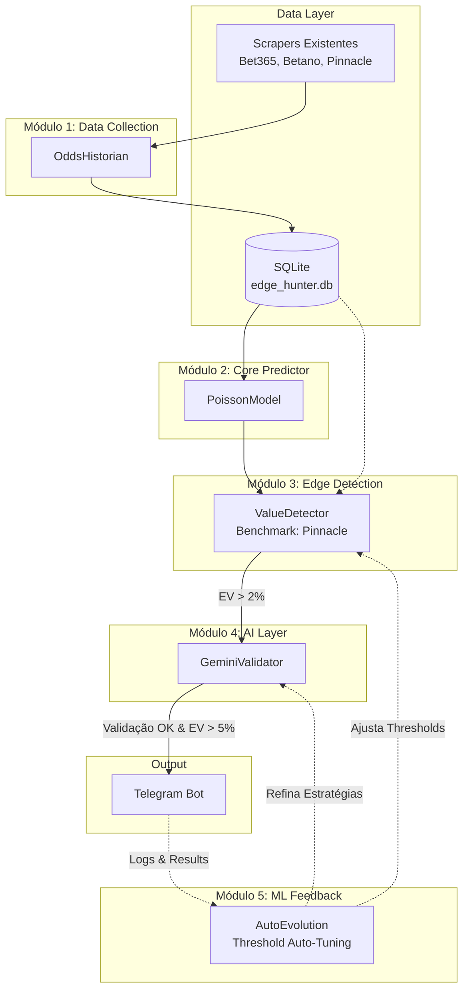

# Master PRD: EdgeHunter Value Betting Pivot

## 1. Metadata
- **PRD ID:** PRD-00
- **Status:** Draft
- **Owner:** Rafael
- **Created Date:** 2026-05-14
- **Version:** 1.0.0
- **Last Updated:** 2026-05-14

## 2. Executive Summary
Este documento detalha o pivô estratégico do projeto EdgeHunter, passando da detecção de surebets (arbitragem) para a identificação de *Value Bets* (odds subavaliadas). O objetivo é construir um sistema sustentável e escalável combinando um core estatístico com uma camada de inteligência artificial (Gemini) para identificar apostas com valor esperado positivo (EV) de forma autônoma. O sucesso principal é medido pela capacidade de gerar um ROI consistente a longo prazo usando uma banca inicial controlada.

## 3. Problem Statement
Atualmente, o modelo de surebets enfrenta desafios significativos que limitam o crescimento e a escalabilidade:
- **Janela de Execução Curta:** As surebets duram segundos ou poucos minutos, o que gera grande fricção operacional e demanda ação imediata.
- **Inconsistência de Dados:** Scrapers sofrem com latência ou pequenas falhas; qualquer atraso na sincronia das odds invalida uma oportunidade de arbitragem.
- **ROI vs. Esforço:** Surebets tipicamente entregam retornos muito baixos (0.5% a 3% por operação). O *Value Betting*, por outro lado, possui variância mas entrega um ROI potencial muito superior (5% a 15%) quando há uma real vantagem competitiva contra o mercado.

## 4. Goals
- **ROI Mensal Alvo:** Alcançar um ROI sustentável de +2% ao mês, após o período de maturação e ajuste (2 meses).
- **Detecções/Dia:** Alertar 1 a 3 oportunidades de altíssima qualidade por dia.
- **Cobertura (Fase 1):** Brasileirão Série A e Premier League.
- **Custo Extra:** R$ 0/mês (manter integrações operando no *free tier* das APIs, como Gemini).

| Fase | Duração | Apostas Reais | Threshold EV | Kelly Fraction | Métrica de Sucesso |
|------|---------|---------------|--------------|----------------|--------------------|
| 1    | 3 sem   | Não           | N/A          | N/A            | 60+ snapshots/jogo |
| 2    | 2 sem   | Não           | 2% (sim)     | 1/4 (sim)      | ROI simulado >=+2% |
| 3a   | 4 sem   | Sim (cuidado) | 3%           | 1/8            | ROI real >= 0%     |
| 3b   | Contínuo| Sim           | 2% (auto-evo)| 1/4 (auto-evo) | ROI 30d >= +2%     |

## 5. Non-Goals
- Substituir o sistema de surebets existente (continuará existindo/rodando).
- Cobrir tênis, basquete ou outros esportes secundários (escopo para Fase 2).
- Colocação de apostas automáticas (apenas envio de alertas detalhados via Telegram).
- Jogos de cassino, roleta, slots ou outras modalidades puramente de azar.

## 6. Success Metrics
- **Primary:** 
  - ROI (% sobre a banca em 30 dias).
  - *Accuracy* preditiva do modelo Poisson no longo prazo.
  - Volume de apostas detectadas e validadas vs apostas perdidas.
- **Secondary:**
  - Latência/Tempo entre detecção da discrepância e o alerta final no Telegram.
  - Taxa de validação da IA (quantas oportunidades EV>2% passam no crivo da IA).
  - Frequência de atuações do motor de ajuste de *threshold*.

## 7. Architecture Overview
Abaixo a representação da arquitetura macro, detalhando o fluxo desde a extração até o alerta:



## 8. Modules Index
Os PRDs técnicos modulares serão desdobrados a seguir:
- [PRD-01: OddsHistorian](./01_odds_historian.md) — Snapshots históricos para coleta temporal.
- [PRD-02: PoissonModel](./02_poisson_model.md) — Predição de probabilidades usando MLE (Maximum Likelihood Estimation).
- [PRD-03: ValueDetector](./03_value_detector.md) — Lógica principal de cálculo para detecção de EV positivo vs Pinnacle.
- [PRD-04: GeminiValidator](./04_gemini_validator.md) — Camada IA para controle de anomalias e validações finas.
- [PRD-05: AutoEvolution](./05_auto_evolution.md) — Motor para calibração dinâmica dos thresholds via APScheduler.

## 9. ADR Index
Decisões arquiteturais documentadas para preservar contexto a longo prazo:
- [ADR-001: Por que Poisson em vez de XGBoost/LightGBM](../architecture/adr_001_poisson_choice.md)
- [ADR-002: Pinnacle como sharp benchmark](../architecture/adr_002_pinnacle_benchmark.md)
- [ADR-003: Estratégia híbrida (lógica + IA)](../architecture/adr_003_hybrid_logic_ai.md)
- [ADR-004: SQLite vs PostgreSQL](../architecture/adr_004_database_choice.md)
- [ADR-005: Gemini Flash vs Pro vs Claude](../architecture/adr_005_llm_choice.md)

## 10. Timeline & Milestones

### Fase 1: Coleta Passiva (Semanas 1-3)
- **Objetivo**: Acumular dados históricos sem risco financeiro
- **Atividades**:
  - Deploy do OddsHistorian (PRD-01)
  - Scrapers existentes rodando + storing snapshots
  - Health checks operacionais
- **Apostas reais**: ❌ Zero
- **Alertas Telegram**: Apenas informativos ("oportunidade detectada em paper mode")
- **Saída**: 60-80 jogos finalizados + snapshots completos

### Fase 2: Paper Trading (Semanas 4-5)
- **Objetivo**: Validar acurácia do sistema sem capital em risco
- **Atividades**:
  - Modelo Poisson treinado (PRD-02)
  - ValueDetector ativo (PRD-03)
  - GeminiValidator ativo (PRD-04)
  - Cada detecção é registrada como "paper bet" no DB
  - Resultado simulado calculado quando jogo termina
- **Apostas reais**: ❌ Zero
- **Métricas trackadas**: ROI simulado, accuracy, false positive rate
- **Critério de avanço para Fase 3**: ROI simulado >= +2% em 2 semanas

### Fase 3: Apostas Reais (Semana 6+)
- **Modo conservador inicial**:
  - Threshold EV: 3% (não 2%) durante primeiros 30 dias
  - Kelly fraction: 1/8 (não 1/4) durante primeiros 30 dias
  - Stake mínimo: R$2 | máximo: 3% do bankroll
- **Após 30 dias com ROI positivo**:
  - Threshold: 2% (padrão)
  - Kelly fraction: 1/4 (padrão)
- **Bankroll inicial**: R$50
- **Saída**: Operação sustentável com auto-evolução ativa

## 11. Risks & Mitigations
| Risco | Mitigação | Severidade | Probabilidade | Owner | Status |
|-------|-----------|------------|---------------|-------|--------|
| **Modelo Poisson com baixa precisão preditiva** | Utilizar validação IA estrita e thresholds conservadores na Fase 1. | Alta | Média | Rafael | Open |
| **Pinnacle API keys limitadas ou revogadas** | Rotação de *user-agents* ou IPs; espaçamento requisições via aiohttp. | Média | Média | Rafael | Open |
| **Excesso de consumo Gemini API (Rate Limits)** | IA engatilhada apenas para picks validadas pelo VD (ex. >2%); buffer lógico fallback. | Baixa | Baixa | Rafael | Open |
| **Instabilidade de dados do Bookmaker (Scrapers)**| Heartbeat do Telegram reporta anomalias de scrapping em até 2 horas. | Média | Alta | Rafael | Open |
| **Baixa liquidez das odds de abertura/fechamento** | Foco estrito em Premier League e Série A para maximizar a representatividade da sharp line. | Baixa | Baixa | Rafael | Open |
| Scraper Fragility (DOM changes) | Health checks; daily sanity check; cross-validate Pinnacle vs OddsPortal | High | High | Rafael | Active |
| Snapshot Async (>120s) | Reject snapshots with max_latency > 120s; alert if persistent | Medium | Medium | System | Active |
| Bookmaker Account Limits | Stake randomization; timing delays; account diversification | High | Medium | Rafael | Active |

## 11.1 Critical Gaps Resolution

### Gap 1: Match ID Standardization

**Problema**: Cada scraper retorna IDs diferentes (Bet365 `event_id`, Pinnacle 
`matchId`, Betano `gameId`, OddsPortal sem ID). Sem padronização, é impossível 
agrupar odds da mesma partida.

**Solução**: Hash determinístico baseado em metadados normalizados.

```python
import hashlib
from datetime import datetime

def generate_match_id(
    home_team: str,
    away_team: str,
    match_date: datetime,
    league: str
) -> str:
    """
    Gera match_id consistente entre todos os scrapers.
    
    Normalização:
    - Times: lowercase, remove acentos, remove sufixos comuns 
      ("FC", "EC", "SC", "AC", "United", "City", etc)
    - Data: apenas a parte de data (YYYY-MM-DD), ignora hora
    - Liga: lowercase, replace espaços por underscore
    """
    normalized = (
        f"{league.lower().replace(' ', '_')}|"
        f"{normalize_team(home_team)}|"
        f"{normalize_team(away_team)}|"
        f"{match_date.strftime('%Y-%m-%d')}"
    )
    return hashlib.sha256(normalized.encode()).hexdigest()[:16]

def normalize_team(team: str) -> str:
    """Remove acentos, lowercase, remove sufixos comuns"""
    import unicodedata
    suffixes = [' fc', ' ec', ' sc', ' ac', ' united', ' city']
    name = unicodedata.normalize('NFKD', team).encode('ascii', 'ignore').decode().lower()
    for suffix in suffixes:
        name = name.replace(suffix, '')
    return name.strip().replace(' ', '_')
```

**Implementação**: Função utility em `app/utils/match_id.py`, usada por TODOS 
os scrapers e o OddsHistorian.

### Gap 2: Bookmaker Account Protection

**Problema**: Bet365 e Betano limitam contas de value bettors em 3-6 meses 
(staking pattern detectável: sempre apostando em odds próximas, sempre EV+).

**Mitigações**:
- **Stakes não-round**: R$5,73 em vez de R$5,00. Implementar `randomize_stake(base) → base + random.uniform(-0.5, 0.5)`
- **Variação de timing**: Não apostar imediatamente após detecção; delay aleatório 5-25min
- **Diversificação de bookmaker**: Se mesma casa for premiada 3x seguidas, próxima vai pra outra
- **Sem promo abuse**: Ignorar bonus, freebets, odds boosts (chamariz pra flag de bettor)
- **Não apostar todos os jogos**: Skipar 30-40% aleatoriamente mesmo em opp boa
- **Limite de 3 apostas/dia**: Reduz pattern de "professional bettor"

**Stories impactadas**: AutoEvolution (PRD-05) precisa implementar essas regras.

### Gap 3: Regulatory Compliance (Lei 14.790/2023)

**Contexto**: Apostas regulamentadas no Brasil a partir de 2025. Casas precisam 
de licença federal. Status de Bet365/Betano:
- **Betano**: Licenciada no Brasil (autorização SPA)
- **Bet365**: Em processo de licenciamento; opera com autorização provisória

**Compliance**:
- Sistema **não realiza apostas autonomamente** (apenas alerts)
- Usuário é responsável por declarar ganhos (IR sobre prêmios)
- Monitorar mudanças regulatórias via canais oficiais

**Não é bloqueante** para implementação técnica, mas documentado para 
ciência do operador.

### Gap 4: Time Zone Strategy

**Problema**: Scrapers retornam timestamps em TZs diferentes:
- Pinnacle: UTC
- Bet365: GMT (UTC ou BST conforme estação)
- Betano: BRT (UTC-3)
- OddsPortal: UTC

**Solução**:
- **Armazenamento**: TUDO em UTC (ISO 8601 com timezone explícito)
- **Display**: Conversão para BRT no Telegram alerts e dashboard
- **Implementação**: Todo scraper retorna `datetime` com timezone-aware

```python
# Em todos os scrapers
from datetime import datetime, timezone
match_date = match_date.astimezone(timezone.utc)  # Sempre UTC no DB
```

### Gap 5: Bankroll Strategy (Híbrido + Manual Override)

**Decisão**:
- **Compound dinâmico**: Bankroll cresce com ganhos, decresce com perdas
- **Floor de proteção**: Nunca abaixo de R$30 (para evitar martingale)
- **Comando Telegram manual**: `/bankroll <valor>` permite override
- **Comando Telegram pause**: `/pause` interrompe alerts de apostas temporariamente

**Pseudocódigo**:
```python
class BankrollManager:
    def __init__(self, initial: float = 50.0, floor: float = 30.0):
        self.bankroll = initial
        self.floor = floor
        self.manual_override = False
    
    def update_after_bet(self, profit_loss: float):
        if self.manual_override:
            return  # Modo manual, não atualiza automaticamente
        
        new_value = self.bankroll + profit_loss
        if new_value < self.floor:
            self.bankroll = self.floor
            await alert("⚠️ Bankroll atingiu floor R$30. Apostas pausadas.")
            self.paused = True
        else:
            self.bankroll = new_value
    
    def manual_set(self, new_value: float, user_id: str):
        """Via comando Telegram /bankroll"""
        self.bankroll = new_value
        self.manual_override = True
        log(f"Bankroll set manually to {new_value} by {user_id}")
```

**Stories adicionais para PRD-05**:
- STORY-05-013: Implementar floor de proteção
- STORY-05-014: Comando Telegram `/bankroll`
- STORY-05-015: Comando Telegram `/pause` e `/resume`

## 12. Resolved Decisions (Previously Open Questions)

### Retention Policy ✅ RESOLVED
- **odds_snapshots**: 6 meses (suficiente para sazonalidade + retreino)
- **value_detections**: 1 ano (auditoria de decisões)
- **gemini_validations**: 3 meses (logs IA)
- **placed_bets**: Indefinido (histórico de performance)
- **Implementação**: Cron job mensal de cleanup

### AI Fallback ✅ RESOLVED
**Decisão**: Graceful degradation
```python
async def validate_with_gemini(opp):
    try:
        return await gemini.validate(opp, timeout=10)
    except (TimeoutError, RateLimitError, APIError) as e:
        return {
            'is_valid': None,
            'fallback_reason': str(e),
            'recommendation': 'place_with_caution',
            'stake_adjustment': 0.5,  # Reduz stake 50%
            'flag': 'SEM_VALIDACAO_IA'
        }
```
**Comportamento**: Sistema continua, alerta vai com flag e stake reduzido.

### Cold Start ✅ RESOLVED
**Decisão**: Estrutura 3 fases (Coleta Passiva → Paper Trading → Real).
Detalhes na Seção 10 atualizada.

## 12.1 Remaining Open Questions
- Devemos suportar tênis em Fase 4 (após 3 meses de operação estável)?
- Backtest histórico com dados de OddsPortal: viável? (precisa investigar)
- Multi-bankroll (separar por liga) seria útil?

## 13. References
- Código Base (EdgeHunter Repositório): `/backend/app/`
- Referências: Algoritmos de Precificação de Apostas usando Distribuição de Poisson (Constantinou).
- Framework Organizacional: Metodologia BMAD-METHOD.
- Lei 14.790/2023 (Marco Regulatório das Apostas no Brasil)
- ISO 8601 (Timezone standard)
- Match ID generation utility: app/utils/match_id.py
